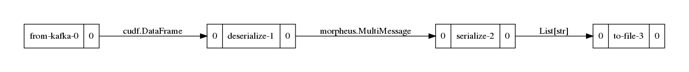

..
   SPDX-FileCopyrightText: Copyright (c) 2022, NVIDIA CORPORATION & AFFILIATES. All rights reserved.
   SPDX-License-Identifier: Apache-2.0

   Licensed under the Apache License, Version 2.0 (the "License");
   you may not use this file except in compliance with the License.
   You may obtain a copy of the License at

   http://www.apache.org/licenses/LICENSE-2.0

   Unless required by applicable law or agreed to in writing, software
   distributed under the License is distributed on an "AS IS" BASIS,
   WITHOUT WARRANTIES OR CONDITIONS OF ANY KIND, either express or implied.
   See the License for the specific language governing permissions and
   limitations under the License.

Basic Usage (via CLI)
=====================

This section focuses on the Morpheus CLI and illustrates how the CLI can be used to configure and run a Morpheus
Pipeline.

Organization
------------

The Morpheus CLI is built on the Click Python package which allows for nested commands and chaining multiple commands
together. At a high level, the CLI is broken up into two main sections:

 * ``run``
    * For running NLP or FIL pipelines.
 * ``tools``
    * Tools/Utilities to help setup, configure and run pipelines and external resources

Users can get help on any command by passing ``--help`` to a command or sub-command. For example, to get help on the
tools:

.. code-block:: console

   $ morpheus tools --help
   Usage: morpheus tools [OPTIONS] COMMAND [ARGS]...

   Options:
     --help  Show this message and exit.  [default: False]

   Commands:
     autocomplete  Utility for installing/updating/removing shell completion for
                   Morpheus
     onnx-to-trt   Converts an ONNX model to a TRT engine

The help text will show arguments, options and all possible sub-commands. Help for each of these sub-commands can be
queried in the same manner:

.. code-block:: console

   $ morpheus tools onnx-to-trt --help
   Usage: morpheus tools onnx-to-trt [OPTIONS]

   Options:
     --input_model PATH              [required]
     --output_model PATH             [required]
     --batches <INTEGER INTEGER>...  [required]
     --seq_length INTEGER            [required]
     --max_workspace_size INTEGER    [default: 16000]
     --help                          Show this message and exit.  [default:
                                     False]

AutoComplete
------------

The Morpheus CLI supports bash, fish, zsh, and powershell autocompletion. To setup autocomplete, it must first be
installed. Morpheus comes with a tool to assist with this:

.. code-block:: console

   $ morpheus tools autocomplete install
   bash completion installed in ~/.bash_completion

After autocomplete has been installed, ``[TAB]`` can be used to show all commands, options and arguments when building
pipelines via the CLI:

.. code-block:: console

   $ morpheus run pipeline- # [TAB][TAB]
   pipeline-fil  pipeline-nlp

Building a Pipeline
-------------------

To build a pipeline via the CLI, users must first specify the type of pipeline, a source object, followed by a sequential list of stages. For each stage, options can be specified to configure the particular stage. Since stages are listed sequentially the output of one stage becomes the input to the next. Unless heavily customized, pipelines will start with either:

.. code-block:: bash

   # For NLP Pipelines
   morpheus run pipeline-nlp ...
   # For FIL Pipelines
   morpheus run pipeline-fil ...

While each stage will have configuration options, there are options that apply to the pipeline as a whole as well. Check
``morpheus run --help``, ``morpheus run pipeline-nlp --help`` and ``morpheus run pipeline-fil --help`` for these global
Pipeline options.

Source Stages
^^^^^^^^^^^^^

All pipelines configured with the CLI need to start with a source object. Currently Morpheus supports two source types:

 * ``from-kafka``
    - Pulls messages from a Kafka cluster into the Pipeline
    - Kafka cluster can be remote or local
    - See :doc:`kafka` for more information
 * ``from-file``
    - Reads from a local file into the Pipeline
    - Supports JSON lines format
    - All lines are read at the start and queued into the pipeline at one time. Useful for performance testing.

Stages
^^^^^^

From this point on, any number of stages can be sequentially added to the command line from start to finish. For example, to build a simple pipeline that reads from kafka, deserializes messages, serializes them, and then writes to a file, use the following:

.. code-block:: console

   $ morpheus --log_level=DEBUG run pipeline-nlp \
      from-kafka --input_topic test_pcap \
      deserialize \
      serialize \
      to-file --filename .tmp/temp_out.json
   ...
   ====Building Pipeline====
   Added source: from-kafka-0
     └─> cudf.DataFrame
   Added stage: deserialize-1
     └─ cudf.DataFrame -> morpheus.MultiMessage
   Added stage: serialize-2
     └─ morpheus.MultiMessage -> List[str]
   Added stage: to-file-3
     └─ List[str] -> List[str]
   ====Building Pipeline Complete!====
   ...

After the ``====Building Pipeline====`` message, if logging is ``INFO`` or greater, the CLI will print a list of all
stages and the type transformations of each stage. To be a valid Pipeline, the output type of one stage must match the
input type of the next. Many stages are flexible and will determine their type at runtime but some stages require a
specific input type. If your Pipeline is configured incorrectly, Morpheus will report the error. For example, if we run
the same command as above but forget the ``serialize`` stage, you will see the following:

.. code-block:: console

   $ morpheus --log_level=DEBUG run pipeline-nlp \
      from-kafka --input_topic test_pcap \
      deserialize \
      to-file --filename .tmp/temp_out.json
   ...

   ====Building Pipeline====
   Added source: from-file-0
     └─> cudf.DataFrame
   Added stage: buffer-1
     └─ cudf.DataFrame -> cudf.DataFrame
   Error occurred during Pipeline.build(). Exiting.
   RuntimeError: The preprocess-nlp stage cannot handle input of <class 'cudf.core.dataframe.DataFrame'>. Accepted input types: (<class 'morpheus.pipeline.messages.MultiMessage'>, typing.StreamFuture[morpheus.pipeline.messages.MultiMessage])

This indicates that the ``to-file`` stage cannot accept the input type of `morpheus.pipeline.messages.MultiMessage`.
This is because the ``to-file`` stage has no idea how to write that class to a file, it only knows how to write strings.
To ensure you have a valid pipeline, look at the ``Accepted input types: (typing.List[str],)`` portion of the message.
This indicates you need a stage that converts from the output type of the ``deserialize`` stage,
`morpheus.pipeline.messages.MultiMessage`, to `typing.List[str]`, which is exactly what the ``serialize`` stage does.

Available Stages
^^^^^^^^^^^^^^^^

For a complete list of available stages, see the :doc:`stages` page. Which stages are available can also be queried from
the CLI using ``morpheus run pipeline-nlp --help`` or ``morpheus run pipeline-fil --help``.

Examples
--------

Simple Identity
^^^^^^^^^^^^^^^

This example will copy the values from Kafka into ``out.jsonlines``.

.. code-block:: bash

   morpheus run pipeline-nlp --viz_file=basic_usage_img/simple_identity.png  \
      from-kafka --input_topic test_pcap \
      deserialize \
      serialize \
      to-file --filename out.jsonlines

Remove Fields from JSON Objects
^^^^^^^^^^^^^^^^^^^^^^^^^^^^^^^

This example will only copy the fiels 'timestamp', 'src_ip' and 'dest_ip' from ``data/pcap_dump.jsonlines`` to
``out.jsonlines``.

.. image:: basic_usage_img/remove_fields_from_json_objects.png

.. code-block:: bash

   morpheus run pipeline-nlp --viz_file=basic_usage_img/remove_fields_from_json_objects.png \
      from-file --filename data/pcap_dump.jsonlines \
      deserialize \
      serialize --include 'timestamp' --include 'src_ip' --include 'dest_ip' \
      to-file --filename out.jsonlines

Monitor Throughput
^^^^^^^^^^^^^^^^^^

This example will report the throughput on the command line.

.. image:: basic_usage_img/monitor_throughput.png

.. code-block:: console

   $ morpheus run pipeline-nlp --viz_file=basic_usage_img/monitor_throughput.png  \
      from-file --filename data/pcap_dump.jsonlines \
      deserialize \
      monitor --description "Lines Throughput" --smoothing 0.1 --unit "lines" \
      serialize \
      to-file --filename out.jsonlines
   Configuring Pipeline via CLI
   Starting pipeline via CLI... Ctrl+C to Quit
   Pipeline visualization saved to basic_usage_img/monitor_throughput.png
   Lines Throughput: 88064lines [00:11, 7529.37lines/s]

Multi-Monitor Throughput
^^^^^^^^^^^^^^^^^^^^^^^^

This example will report the throughput for each stage independently. Keep in mind, ``buffer`` stages are necessary to
decouple one stage from the next. Without the buffers, all montioring would show the same throughput.

.. image:: basic_usage_img/multi_monitor_throughput.png

.. code-block:: console

   $ morpheus run pipeline-nlp --viz_file=basic_usage_img/multi_monitor_throughput.png  \
      from-file --filename data/pcap_dump.jsonlines \
      monitor --description "From File Throughput" \
      buffer \
      deserialize \
      monitor --description "Deserialize Throughput" \
      buffer \
      serialize \
      monitor --description "Serialize Throughput" \
      buffer \
      to-file --filename out.jsonlines --overwrite
   Configuring Pipeline via CLI
   Starting pipeline via CLI... Ctrl+C to Quit
   Pipeline visualization saved to basic_usage_img/multi_monitor_throughput.png
   From File Throughput: 93085messages [00:09, 83515.94messages/s]
   Deserialize Throughput: 93085messages [00:20, 9783.56messages/s]
   Serialize Throughput: 93085messages [00:20, 9782.07messages/s]

NLP Kitchen Sink
^^^^^^^^^^^^^^^^

This example shows an NLP Pipeline which uses most stages available in Morpheus.

.. image:: basic_usage_img/multi_monitor_throughput.png

.. code-block:: console

   $ morpheus run --num_threads=8 --pipeline_batch_size=1024 --model_max_batch_size=32 \
      pipeline-nlp --viz_file=basic_usage_img/nlp_kitchen_sink.png  \
      from-file --filename data/pcap_dump.jsonlines \
      buffer --count=500 \
      deserialize \
      preprocess \
      buffer \
      inf-triton --model_name=sid-minibert-onnx --server_url=localhost:8001 \
      monitor --description "Inference Rate" --smoothing=0.001 --unit "inf" \
      add-class \
      filter --threshold=0.8 \
      serialize --include 'timestamp' --exclude '^_ts_' \
      to-kafka --output_topic "inference_output"
   Configuring Pipeline via CLI
   Starting pipeline via CLI... Ctrl+C to Quit
   Pipeline visualization saved to basic_usage_img/nlp_kitchen_sink.png
   Inference Rate: 16384inf [19:50, 13.83inf/s]
