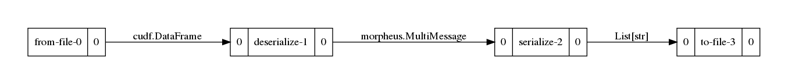
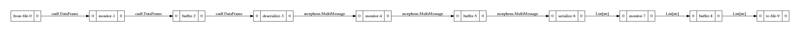
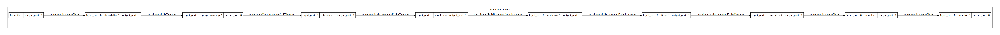

..
   SPDX-FileCopyrightText: Copyright (c) 2022, NVIDIA CORPORATION & AFFILIATES. All rights reserved.
   SPDX-License-Identifier: Apache-2.0

   Licensed under the Apache License, Version 2.0 (the "License");
   you may not use this file except in compliance with the License.
   You may obtain a copy of the License at

   http://www.apache.org/licenses/LICENSE-2.0

   Unless required by applicable law or agreed to in writing, software
   distributed under the License is distributed on an "AS IS" BASIS,
   WITHOUT WARRANTIES OR CONDITIONS OF ANY KIND, either express or implied.
   See the License for the specific language governing permissions and
   limitations under the License.

Examples
--------

Simple Identity
^^^^^^^^^^^^^^^

This example will copy the values from Kafka into ``out.jsonlines``.

.. image:: img/simple_identity.png

.. code-block:: bash

   morpheus run pipeline-nlp --viz_file=basic_usage_img/simple_identity.png  \
      from-kafka --input_topic test_pcap \
      deserialize \
      serialize \
      to-file --filename out.jsonlines

Remove Fields from JSON Objects
^^^^^^^^^^^^^^^^^^^^^^^^^^^^^^^

This example will only copy the fiels 'timestamp', 'src_ip' and 'dest_ip' from ``data/pcap_dump.jsonlines`` to
``out.jsonlines``.

.. code-block:: bash

   morpheus run pipeline-nlp --viz_file=basic_usage_img/remove_fields_from_json_objects.png \
      from-file --filename data/pcap_dump.jsonlines \
      deserialize \
      serialize --include 'timestamp' --include 'src_ip' --include 'dest_ip' \
      to-file --filename out.jsonlines

Monitor Throughput
^^^^^^^^^^^^^^^^^^

This example will report the throughput on the command line.

.. image:: img/monitor_throughput.png

.. code-block:: console

   $ morpheus run pipeline-nlp --viz_file=basic_usage_img/monitor_throughput.png  \
      from-file --filename data/pcap_dump.jsonlines \
      deserialize \
      monitor --description "Lines Throughput" --smoothing 0.1 --unit "lines" \
      serialize \
      to-file --filename out.jsonlines
   Configuring Pipeline via CLI
   Starting pipeline via CLI... Ctrl+C to Quit
   Pipeline visualization saved to basic_usage_img/monitor_throughput.png
   Lines Throughput: 88064lines [00:11, 7529.37lines/s]

Multi-Monitor Throughput
^^^^^^^^^^^^^^^^^^^^^^^^

This example will report the throughput for each stage independently. Keep in mind, ``buffer`` stages are necessary to
decouple one stage from the next. Without the buffers, all montioring would show the same throughput.

.. code-block:: console

   $ morpheus run pipeline-nlp --viz_file=basic_usage_img/multi_monitor_throughput.png  \
      from-file --filename data/pcap_dump.jsonlines \
      monitor --description "From File Throughput" \
      buffer \
      deserialize \
      monitor --description "Deserialize Throughput" \
      buffer \
      serialize \
      monitor --description "Serialize Throughput" \
      buffer \
      to-file --filename out.jsonlines --overwrite
   Configuring Pipeline via CLI
   Starting pipeline via CLI... Ctrl+C to Quit
   Pipeline visualization saved to basic_usage_img/multi_monitor_throughput.png
   From File Throughput: 93085messages [00:09, 83515.94messages/s]
   Deserialize Throughput: 93085messages [00:20, 9783.56messages/s]
   Serialize Throughput: 93085messages [00:20, 9782.07messages/s]

NLP Kitchen Sink
^^^^^^^^^^^^^^^^

This example shows an NLP Pipeline which uses most stages available in Morpheus.

.. code-block:: console

   $ morpheus run --num_threads=8 --pipeline_batch_size=1024 --model_max_batch_size=32 \
      pipeline-nlp --viz_file=basic_usage_img/nlp_kitchen_sink.png  \
      from-file --filename data/pcap_dump.jsonlines \
      buffer --count=500 \
      deserialize \
      preprocess \
      buffer \
      inf-triton --model_name=sid-minibert-onnx --server_url=localhost:8001 \
      monitor --description "Inference Rate" --smoothing=0.001 --unit "inf" \
      add-class \
      filter --threshold=0.8 \
      serialize --include 'timestamp' --exclude '^_ts_' \
      to-kafka --output_topic "inference_output"
   Configuring Pipeline via CLI
   Starting pipeline via CLI... Ctrl+C to Quit
   Pipeline visualization saved to basic_usage_img/nlp_kitchen_sink.png
   Inference Rate: 16384inf [19:50, 13.83inf/s]
