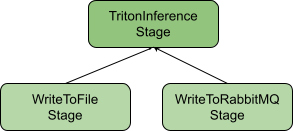

<!--
SPDX-FileCopyrightText: Copyright (c) 2022, NVIDIA CORPORATION & AFFILIATES. All rights reserved.
SPDX-License-Identifier: Apache-2.0

Licensed under the Apache License, Version 2.0 (the "License");
you may not use this file except in compliance with the License.
You may obtain a copy of the License at

http://www.apache.org/licenses/LICENSE-2.0

Unless required by applicable law or agreed to in writing, software
distributed under the License is distributed on an "AS IS" BASIS,
WITHOUT WARRANTIES OR CONDITIONS OF ANY KIND, either express or implied.
See the License for the specific language governing permissions and
limitations under the License.
-->

# Morpheus Developer Documentation / Guide
## Morpheus Architecture Overview
The organization of Morpheus can be broken down into four different layers. Working from the top down:
* Orchestration Layer
  * Responsible for coordinating pipelines and facilitating communication.
    * That is, monitoring pipelines, transferring messages between pipelines, starting and stopping pipelines, assigning resources to pipelines,  and so on.
  * Plays a large role in multi-machine pipelines but works out of the box for single-machine pipelines.
* Pipeline Layer
  *  Composed of one or more stages connected by edges.
  * Data moves between stages using buffered channels, and the pipeline will automatically handle backpressure by monitoring the amount of data in each edge buffer.
* Stage Layer
  * Main building blocks in Morpheus.
  * Responsible for executing a specific function on incoming data from previous stages in the pipeline.
  * Isolated from each other and can be thought of as black boxes.
  * Composed of one or more nodes, connected by edges.
  * All nodes are guaranteed to operate on the same machine, in the same process space.
* Node Layer
  * Smallest building block in Morpheus.
  * Each node operates on the same thread.
  * Composed of one or more operators in the reactive programming style.

## Morpheus Pipeline Details
Pipelines are a collection of one or more stages that are connected via edges. Data flows from one stage to the next across these edges using buffers. We utilize these buffers to allow stages to process messages at different rates. Once each stage is done processing a message, the pipeline will move it onto the next stage's buffer for processing. This process continues until the message has made it through the entire pipeline.

The main goal of the pipeline is to maximize throughput via parallel execution of the stages. So we can utilize hardware optimally and avoid processing individual messages sequentially. Given a multi-stage pipeline consisting of stages 1 and 2. Stage 1 collects its first message from its data source and begins processing it once Stage 1 is done with its first message, the resulting output message will be forwarded to Stage 2. At this point, Stage 1 immediately begins processing the next input to the pipeline, while Stage 2 begins work on the output of Stage 1. This allows for multiple messages to be in flight in the pipeline at a time, increasing parallelization.

Utilizing buffers between stages in this way does come at a cost. Increasing the size of the buffers helps improve parallelization by ensuring all stages have some work to do. But this also increases latency since messages can sit in a buffer waiting to be processed. The inverse is also true. Decreasing the buffer sizes improves latency, but can starve some stages of work to do, decreasing parallelization. The pipeline has to walk a fine line of keeping all stages supplied with data with the smallest buffers possible.

## Morpheus Stage Details
A stage is the fundamental building block in Morpheus and is responsible for performing all of the work in a pipeline. A stage can encapsulate any piece of functionality and is capable of integrating with any service or external library. This freedom allows stages to range from very small Python map functions up to very complex inference stages, which connect to services and work in multiple threads. For example, Morpheus has simple stages for actions like reading and writing to a file and more complex stages like the Triton inference stage, which can send many asynchronous inference requests using shared device memory.

While stages are very flexible, they all comprise three main pieces: identification, type inference, and node creation.

### Identification
The stage identifier is a unique string used in both logging and creating the stage from the CLI.

### Type Inference
To perform work, each stage needs to know what type of data it will be operating on. Since Morpheus can pass any type of data from stage to stage, the pipeline must ensure compatible types at every edge connection between stages. This process is called stage type inference and is performed during the pipeline build phase.

Stage type inference is necessary because the output type of some stages may depend on the output type of the previous stage. For example, consider a simple pass through stage that passes the input message to the next stage unmodified. If our pass through stage is connected to another stage generating a string, its output type will be a string. Instead, if it's connected to another stage generating an integer, its output type will be an integer.

Due to the dynamic nature of the output type of a stage, stages must specify a type inference function that accepts an input type and returns the output type. Starting at the source stages, the pipeline will use this function to determine the output type of the source stages. This result will then be passed to the type inference function of the next stage, and so on until the input and output types of every stage in the pipeline have been determined.

After the build phase, the output types of stages cannot be changed. Returning a different type than specified during the build phase will result in undefined behavior.

### Node Creation
The most important piece of a stage is node creation. The node creation function is responsible for creating the instances of the nodes which will make up a stage. Like a pipeline, stages can be built up of one or more smaller nodes connected by edges.

The difference between stages and nodes is that stages guarantee that the same machine will run all nodes in the same process space. This allows nodes to optimize the information they pass between themselves to ensure maximum performance. For example, two nodes could pass a raw GPU device pointer between them, allowing maximum performance with minimum overhead. Without this guarantee that both nodes are running in the same process space, passing such a low-level piece of information would be unsafe.

## Creating a New Morpheus Stage
### Python Stage
Morpheus includes several stages to choose from when building a custom pipeline, which can be included and configured to suit your needs. However, there are likely going to be situations that require writing a custom stage. Morpheus stages are written in Python and optionally may include a C++ implementation.

Morpheus makes use of the Neo graph-execution framework. Morpheus pipelines are built on top of Neo pipelines. Pipelines in Neo are made up of segments; however, in many common cases, a Neo pipeline will consist of only a single segment. Our Morpheus stages will interact with the Neo segment to build nodes and add them to the Neo graph. In the common case, a Morpheus stage will add a single node to the graph, but in some cases will add multiple nodes to the graph.

#### A Simple Pass Through Stage
To start, we will implement a single stage that could be included in a pipeline. For illustration, this stage will do nothing but take the input from the previous stage and forward it to the next stage. All Morpheus stages have several things in common, so while this doesn't do too much, it ends up being a good starting point for writing a new stage. From there, we can add our functionality as needed.

Defining this stage requires us to specify the stage type. Morpheus stages contain a single input and a single output inherited from `SinglePortStage`.  Stages that act as sources of data, in that they do not take an input from a prior stage but rather produce data from a source such as a file, Kafka service, or other external sources, will need to inherit from the `SingleOutputSource` base class.  We start our class definition with a few basic imports:
```python
import typing

import neo
from morpheus.pipeline.pipeline import SinglePortStage
from morpheus.pipeline.pipeline import StreamPair

class PassThruStage(SinglePortStage):
```

There are three methods that need to be defined in our new subclass to implement the stage interface: `name`, `accepted_types`, and `_build_single`. In practice, it is often necessary to define at least one more method which will perform the actual work of the stage; by convention, this method is typically named on_data, which we will define in our examples.

`name` is a property method; it should return a user-friendly name for the stage. Currently, this property is only used for debugging purposes, and there are no requirements on the content or format of the name.
```python
    @property
    def name(self) -> str:
        return "pass-thru"
```

The `accepted_types` method returns a tuple of message classes that this stage accepts as valid inputs. Morpheus uses this to validate that the parent of this stage emits a message that this stage can accept. Since our stage is a pass through, we will declare that we can accept any incoming message type; however, in practice, production stages will often declare a single Morpheus message class such as `MessageMeta` and `MultiMessage` (see the message classes defined in `morpheus.pipeline.messages` for a complete list).
```python
    def accepted_types(self) -> typing.Tuple:
        return (typing.Any,)
```

Our `on_data` method accepts the incoming message and returns a message. The returned message can be the same message instance that we received as our input or it could be a new message instance. The method is named `on_data` by convention; however, it is not part of the API. In the next section, we will register it as a callback in Morpheus.
```python
    def on_data(self, message: typing.Any):
        # Return the message for the next stage
        return message
```

Finally, the `_build_single` method will be used at build time to wire our stage into the pipeline. `_build_single` receives an instance of the Neo pipeline segment along with a `StreamPair` instance. We will be using the segment instance to build a node from our stage and add it to the pipeline segment. The `StreamPair` argument is a tuple, the first element is our parent node, and the second is our parent node's output type. The return type of this method is also a `StreamPair`; typically, we will be returning our newly constructed node along with our output type.

In most cases, a Morpheus stage will define and build a single Neo node. In some advanced cases, a stage can construct more than one node. For our purposes, a Morpheus stage defines information about the type of node(s) it builds, while the node is the instance wired into the Neo pipeline. To build the node, we will call the `make_node` method of the segment instance, passing to it our name and our `on_data` method. We used the `unique_name` property, which will take the name property which we already defined and append a unique id to it.
```python
node = seg.make_node(self.unique_name, self.on_data)
```

Next, we will define an edge connecting our new node to our parent node:
```python
seg.make_edge(input_stream[0], node)
```

Finally, we will return a new tuple of our node and output type. Since this is a pass through node that can accept any input type, we will return our parent's type.
```python
return node, input_stream[1]
```

##### Putting it all together
```python
import typing

import neo

from morpheus.pipeline.pipeline import SinglePortStage
from morpheus.pipeline.pipeline import StreamPair

class PassThruStage(SinglePortStage):
    @property
    def name(self) -> str:
        return "pass-thru"

    def accepted_types(self) -> typing.Tuple:
        return (typing.Any,)

    def on_data(self, message: typing.Any):
        # Return the message for the next stage
        return message

    def _build_single(self, seg: neo.Segment, input_stream: StreamPair) -> StreamPair:
        node = seg.make_node(self.unique_name, self.on_data)
        seg.make_edge(input_stream[0], node)

        return node, input_stream[1]
```

##### Testing our new Stage
To start testing our new pass through stage, we are going to construct a simple pipeline and add our new stage to it. This pipeline will do the minimum work necessary to verify our pass through stage: define a source stage, which will produce data and inject it into the pipeline; this data will be read and processed by our pass through stage, and then forwarded on to a monitoring stage which will record the messages it receives and terminate the pipeline.

Imports are needed for this example. This assumes we saved the code for the PassThruStage in a file named "pass_thru.py" in the same directory as this script which we will name "run_passthru.py".
```python
import logging
import os

from morpheus.config import Config
from morpheus.pipeline import LinearPipeline
from morpheus.pipeline.general_stages import MonitorStage
from morpheus.pipeline.input.from_file import FileSourceStage
from morpheus.utils.logging import configure_logging

from pass_thru import PassThruStage
```

Before constructing the pipeline, we need to do a bit of environment configuration, starting with the Morpheus logger:
```python
configure_logging(log_level=logging.DEBUG)
```

Next, we will build a Morpheus config object. In the next example, we will cover setting some common configuration parameters. For now, it is important to know that we will always need to build a config object.
```python
config = Config()
```

For our test, we will use the `FileSourceStage` to read in a large file containing lines of JSON corresponding to email messages and package them as Morpheus message objects for our pass through stage to consume.
```python
pipeline.set_source(FileSourceStage(config, filename=input_file, iterative=False))
```

Next, we will add our new stage to the pipeline and then add a MonitorStage which will measure the throughput of our pass through stage.

```python
pipeline.add_stage(PassThruStage(config))
pipeline.add_stage(MonitorStage(config))
```

Finally, we run the pipeline:
```python
pipeline.run()
```

The output should look like this:
```
====Registering Pipeline====
====Registering Pipeline Complete!====
====Starting Pipeline====
====Building Pipeline====
Added source: <from-file-0; FileSourceStage(filename=./examples/data/email.jsonlines, iterative=False, file_type=FileTypes.Auto, repeat=1, filter_null=True, cudf_kwargs=None)>
  └─> morpheus.MessageMeta
Added stage: <pass-thru-1; PassThruStage(args=(), kwargs={})>
  └─ morpheus.MessageMeta -> morpheus.MessageMeta
Added stage: <monitor-2; MonitorStage(description=Progress, smoothing=0.05, unit=messages, delayed_start=False, determine_count_fn=None)>
  └─ morpheus.MessageMeta -> morpheus.MessageMeta
====Building Pipeline Complete!====
Starting! Time: 1648834587.3092508
====Pipeline Started====
Progress[Complete]: 25229messages [00:00, 57695.02messages/s]
====Pipeline Complete====
```

##### Putting it all together
Note this code assumes that the `MORPHEUS_ROOT` environment variable is set to the root of the Morpheus project repository:
```python
import logging
import os

from morpheus.config import Config
from morpheus.pipeline import LinearPipeline
from morpheus.pipeline.general_stages import MonitorStage
from morpheus.pipeline.input.from_file import FileSourceStage
from morpheus.utils.logging import configure_logging

from pass_thru import PassThruStage

def run_pipeline():
    # Enable the Morpheus logger
    configure_logging(log_level=logging.DEBUG)

    root_dir = os.environ['MORPHEUS_ROOT']
    input_file = os.path.join(root_dir, 'examples/data/email.jsonlines')

   config = Config()

    # Create a linear pipeline object
    pipeline = LinearPipeline(config)

    # Set source stage
    pipeline.set_source(FileSourceStage(config, filename=input_file, iterative=False))

    # Add our own stage
    pipeline.add_stage(PassThruStage(config))

    # Add monitor to record the performance of our new stage
    pipeline.add_stage(MonitorStage(config))

    # Run the pipeline
    pipeline.run()

if __name__ == "__main__":
    run_pipeline()
```

### A Real-World Application: Phishing Detection
#### Data Preprocessing

Now that we've seen a basic example of how to create a stage and use it in the context of a pipeline, we'll move on to a more advanced example that is representative of what we might want to do in a real-world situation. Given a set of records, each of which represents an email, suppose we want to predict which records correspond to fraudulent emails.

As part of this process, we might want to use a classification model trained on various pieces of metadata, such as recipient count, in addition to the raw content of each email. If we suppose this is true for our example, we need to build and connect a pre-processing stage to attach this information to each record before applying our classifier.

For this task, we'll need to define a new stage, which we will call our `RecipientFeaturesStage`, which will receive an input corresponding to an email, count the number of recipients in the email's metadata, and construct a Morpheus `MessageMeta` object that will contain the record content along with the augmented metadata.

For this stage, the code will look very similar to the previous example with a few notable changes. We will be working with the `MessageMeta` class. This is a Morpheus message containing a [cuDF](https://docs.rapids.ai/api/cudf/stable/) [DataFrame](https://docs.rapids.ai/api/cudf/stable/api_docs/dataframe.html); since we will expect our new stage to operate on `MessageMeta` types our new accepted_types method now looks like:
```python
    def accepted_types(self) -> typing.Tuple:
        return (MessageMeta,)
```

Next, we will update our on_data method to perform the actual work.
We grab a reference to the incoming message's `df` attribute. It is important to note that this is a reference, and any changes made to this will be performed in place on the existing message instance.
```python
    def on_data(self, message: MessageMeta):
        # Get the DataFrame from the incoming message
        df = message.df

        df['to_count'] = df['To'].str.count('@')
        df['bcc_count'] = df['BCC'].str.count('@')
        df['cc_count'] = df['CC'].str.count('@')
        df['total_recipients'] = df['to_count'] + df['bcc_count'] + df['cc_count']

        # Attach features to string data
        df['data'] = (df['to_count'].astype(str) + '[SEP]' +
                      df['bcc_count'].astype(str) + '[SEP]' +
                      df['cc_count'].astype(str) + '[SEP]' +
                      df['total_recipients'].astype(str) + '[SEP]' +
                      df['Message'])

        # Return the message for the next stage
        return message
```

If mutating the data frame is undesirable, we could make a call to the data frame's [copy](https://docs.rapids.ai/api/cudf/stable/api_docs/api/cudf.DataFrame.copy.html#cudf.DataFrame.copy) method, and return a new message, note that this would come at the cost of performance and increased memory. Our updated `on_data` method would look like this (changing the first & last lines of the method):
```python
    def on_data(self, message: MessageMeta):
        # Take a copy of the DataFrame from the incoming message
        df = message.df.copy(True)
        ...
        # Construct and return a new message containing our DataFrame
        return MessageMeta(df=df)
```


Our `_build_single` method remains unchanged; even though we are modifying the incoming messages, our input and output types remain the same.

##### Putting it all together
```python
import typing

import neo

from morpheus.pipeline.messages import MessageMeta
from morpheus.pipeline.pipeline import SinglePortStage
from morpheus.pipeline.pipeline import StreamPair


class RecipientFeaturesStage(SinglePortStage):
    @property
    def name(self) -> str:
        return "recipient-features"

    def accepted_types(self) -> typing.Tuple:
        return (MessageMeta,)

    def on_data(self, message: MessageMeta):
        # Get the DataFrame from the incoming message
        df = message.df

        df['to_count'] = df['To'].str.count('@')
        df['bcc_count'] = df['BCC'].str.count('@')
        df['cc_count'] = df['CC'].str.count('@')
        df['total_recipients'] = df['to_count'] + df['bcc_count'] + df['cc_count']

        # Attach features to string data
        df['data'] = (df['to_count'].astype(str) + '[SEP]' +
                      df['bcc_count'].astype(str) + '[SEP]' +
                      df['cc_count'].astype(str) + '[SEP]' +
                      df['total_recipients'].astype(str) + '[SEP]' +
                      df['Message'])

        # Return the message for the next stage
        return message

    def _build_single(self, seg: neo.Segment, input_stream: StreamPair) -> StreamPair:
        node = seg.make_node(self.unique_name, self.on_data)
        seg.make_edge(input_stream[0], node)

        return node, input_stream[1]
```

##### Testing our new Stage
To ensure our new stage is working, we will use the pipeline from the previous example and insert our new stage where the pass through stage was previously, between the `FileSource` and  `MonitorStage` stages.

Update these lines:
```python
    # Add our own stage
    pipeline.add_stage(PassThruStage(config))

    # Add monitor to record the performance of our new stage
    pipeline.add_stage(MonitorStage(config))
```

To:
```python
    # Add our own stages
    pipeline.add_stage(PassThruStage(config))
    pipeline.add_stage(RecipientFeaturesStage(config))

    # Add monitor to record the performance of our new stage
    pipeline.add_stage(MonitorStage(config))
```

#### Predicting fraudulent emails with accelerated machine learning.
For this example, we'll be using the `RecipientFeaturesStage` from the previous example in a real-world pipeline to detect fraudulent emails. The pipeline we will be building makes use of the `TritonInferenceStage` which is a pre-defined Morpheus stage designed to support the execution of Natural Language Processing (NLP) models via NVIDIA's [Triton inference server framework](https://developer.nvidia.com/nvidia-triton-inference-server), which allows for GPU accelerated ML/DL and seamless co-location and execution of a wide variety of model frameworks. For our application, we will be using the `phishing-bert-onnx` model, which is included with Morpheus in the `models/triton-model-repo/` directory.

The important thing to note is that the Triton server lives outside of the execution of the Morpheus pipeline and cannot be running on the same machine(s) that the pipeline is executing on. Instead, Triton is a service that we are communicating with via HTTP & [gRPC](https://grpc.io/) network protocols to interact with machine learning models hosted by Triton.

##### Launching Triton
Triton will need to be running while we execute our pipeline. For simplicity, we will launch it locally inside of a Docker container.

Note: This step assumes you have both [Docker](https://docs.docker.com/engine/install/) and the [Nvidia container toolkit](https://docs.docker.com/engine/install/) installed.

From the root of the Morpheus project we will launch a Triton Docker container mounting the models directory in the container.
```shell
docker run --rm -ti --gpus=all -p8000:8000 -p8001:8001 -p8002:8002 -v $PWD/models:/models nvcr.io/nvidia/tritonserver:22.02-py3 tritonserver --model-repository=/models/triton-model-repo --exit-on-error=false --log-info=true
```

Once we have Triton running, we can verify that it is healthy using [curl](https://curl.se/); the `/v2/health/live` endpoint should return a 200 status code:
```shell
curl -v "localhost:8000/v2/health/live"
```

We can also query Triton for available models:
```shell
curl -X POST "localhost:8000/v2/repository/index"
```

Along  information about the `phishing-bert-onnx` model which we are going to be using:
```shell
curl "localhost:8000/v2/models/phishing-bert-onnx/config"
{"name":"phishing-bert-onnx","versions":["1"],"platform":"onnxruntime_onnx","inputs":[{"name":"input_ids","datatype":"INT64","shape":[-1,128]},{"name":"attention_mask","datatype":"INT64","shape":[-1,128]}],"outputs":[{"name":"output","datatype":"FP32","shape":[-1,2]}]}
```
Here is the expected length of the model inputs indicated by `"shape":[-1,128]}`.

##### Defining our Pipeline
Set up our file paths for our input and output files. For simplicity, we assume that the `MORPHEUS_ROOT` environment variable is set to the root of the Morpheus project repository. In a production deployment, it may be more prudent to replace our usage of environment variables with command-line flags.
```python
    root_dir = os.environ['MORPHEUS_ROOT']
    out_dir = os.environ.get('OUT_DIR', '/tmp')

    data_dir = os.path.join(root_dir, 'data')
    labels_file = os.path.join(data_dir, 'labels_phishing.txt')
    vocab_file = os.path.join(data_dir, 'bert-base-uncased-hash.txt')

    input_file = os.path.join(root_dir, 'examples/data/email.jsonlines')
    results_file = os.path.join(out_dir, 'detections.jsonlines')
```

To start, we will need to set a few parameters on the config object, these are parameters which are global to the pipeline as a whole, while individual stages receive their own parameters..
```python
    config = Config()
    config.mode = PipelineModes.NLP
    config.num_threads = psutil.cpu_count()
    config.feature_length = 128

    with open(labels_file) as fh:
        config.class_labels = [x.strip() for x in fh]
```

We set our pipeline mode to NLP. Next, we use the third-party [psutils](https://psutil.readthedocs.io/en/stable/) library to set the `num_threads` property to match the number of cores in our system.

The `feature_length` property needs to match the length of the model inputs, which we queried from the model's config endpoint in the previous section.

Ground truth classification labels are read from the `data/labels_phishing.txt` file included in Morpheus.

Now that our config object is populated we move on to the pipeline itself. We are using the same input file from the previous examples, and to tokenize the input data we add Morpheus' `PreprocessNLPStage` with the `data/bert-base-uncased-hash.txt` vocabulary file.
```python
    pipeline.add_stage(
        PreprocessNLPStage(
            config,
            vocab_hash_file=vocab_file,
            truncation=True,
            do_lower_case=True,
            add_special_tokens=False))
```

This stage uses the [cudf subword tokenizer](https://docs.rapids.ai/api/cudf/stable/api_docs/api/cudf.core.subword_tokenizer.SubwordTokenizer.__call__.html) to transform strings into a tensor of numbers to be fed into the neural network model. Rather than split the string by characters or whitespaces, we split them into meaningful subwords based upon the occurrence of the subwords in a large training corpus. You can find more details here: [https://arxiv.org/abs/1810.04805v2](https://arxiv.org/abs/1810.04805v2). Briefly, the text is converted to subword token ids based on the vocabulary file from a pretrained tokenizer. This stage contains the parameters to truncate the length of the text to a max number of tokens (`truncation=True`), change the casing to all lowercase (`do_lower_case=True`), and the choice to add the default BERT special tokens like `[SEP]` for separation between two sentences and `[CLS]` at the start of the text (not used here but enabled with: `add_special_tokens=True`). The tokenizer parameters and vocabulary hash file should exactly match what was used for tokenization during the training of the NLP model.

At this point, we have a pipeline that reads in a set of records and preprocesses them with the required metadata for our classifier to predict on. Our next step is to define a stage that applies a machine learning model to our `MessageMeta` object. To accomplish this, we will be using Morpheus' `TritonInferenceStage` class which will communicate with the `phishing-bert-onnx` model, which we already loaded into Triton.

Next, we will add a monitor stage to measure the inference rate, and a filter stage to filter out any results below a probability threshold of `0.9`.
```python
    # Add a inference stage
    pipeline.add_stage(
        TritonInferenceStage(
            config,
            model_name='phishing-bert-onnx',
            server_url=triton_url,
            force_convert_inputs=True,
        ))

    pipeline.add_stage(MonitorStage(config, description="Inference Rate", smoothing=0.001, unit="inf"))

    # Filter values lower than 0.9
    pipeline.add_stage(FilterDetectionsStage(config, threshold=0.9))
```

Lastly, we will save our results to disk. For this purpose, we are using two stages often used in conjunction with each other, the `SerializeStage` and the `WriteToFileStage`. `SerializeStage` is used to include and exclude columns desired in the output in addition to this converting from the `MultiMessage` class used by the previous stages to the `MessageMeta` class expected by the `WriteToFileStage`. The `WriteToFileStage` will append message data of the output file as messages are received; however, for performance, the `WriteToFileStage` does not flush contents out to disk for each message received, allowing the underlying [buffered output stream to flush as needed](https://gcc.gnu.org/onlinedocs/libstdc++/manual/streambufs.html), and closing the file handle on shutdown.
```python
    # Write the file to the output
    pipeline.add_stage(SerializeStage(config))
    pipeline.add_stage(WriteToFileStage(config, filename=results_file, overwrite=True))
```

Note that we didn't specify the output format. In our example, the result file contains the extension `.jsonlines`. Morpheus will infer the output format based on the extension. At time of writing the extensions that Morpheus will infer are: `.csv`, `.json` & `.jsonlines`

To explicitly set the output format we could specify the `file_type` argument to the `WriteToFileStage` which is an enumeration defined in `morpheus._lib.file_types.FileTypes`. Current values defined are:
* `FileTypes.Auto`
* `FileTypes.JSON`
* `FileTypes.CSV`

##### Putting it all together
```python
import logging
import os

import psutil

from morpheus.config import Config
from morpheus.config import PipelineModes
from morpheus.pipeline import LinearPipeline
from morpheus.pipeline.general_stages import FilterDetectionsStage
from morpheus.pipeline.general_stages import MonitorStage
from morpheus.pipeline.inference.inference_triton import TritonInferenceStage
from morpheus.pipeline.input.from_file import FileSourceStage
from morpheus.pipeline.output.serialize import SerializeStage
from morpheus.pipeline.output.to_file import WriteToFileStage
from morpheus.pipeline.preprocessing import DeserializeStage
from morpheus.pipeline.preprocessing import PreprocessNLPStage
from morpheus.utils.logging import configure_logging

from recipient_feature_stage import RecipientFeaturesStage

def run_pipeline():
    # Enable the default logger
    configure_logging(log_level=logging.INFO)

    triton_url = os.environ.get('TRITON_URL', 'localhost:8001')
    root_dir = os.environ['MORPHEUS_ROOT']
    out_dir = os.environ.get('OUT_DIR', '/tmp')

    data_dir = os.path.join(root_dir, 'data')
    labels_file = os.path.join(data_dir, 'labels_phishing.txt')
    vocab_file = os.path.join(data_dir, 'bert-base-uncased-hash.txt')

    input_file = os.path.join(root_dir, 'examples/data/email.jsonlines')
    results_file = os.path.join(out_dir, 'detections.jsonlines')


    # Its necessary to configure the pipeline for NLP mode
    config = Config()
    config.mode = PipelineModes.NLP

    # Set the thread count to match our cpu count
    config.num_threads = psutil.cpu_count()
    config.feature_length = 128

    with open(labels_file) as fh:
        config.class_labels = [x.strip() for x in fh]

    # Create a linear pipeline object
    pipeline = LinearPipeline(config)

    # Set source stage
    pipeline.set_source(FileSourceStage(config, filename=input_file, iterative=False))

    # Add our custom stage
    pipeline.add_stage(RecipientFeaturesStage(config))

    # Add a deserialize stage
    pipeline.add_stage(DeserializeStage(config))

    # Tokenize the input
    pipeline.add_stage(
        PreprocessNLPStage(
            config,
            vocab_hash_file=vocab_file,
            truncation=True,
            do_lower_case=True,
            add_special_tokens=False))

    # Add a inference stage
    pipeline.add_stage(
        TritonInferenceStage(
            config,
            model_name='phishing-bert-onnx',
            server_url=triton_url,
            force_convert_inputs=True,
        ))

    # Monitor the inference rate
    pipeline.add_stage(MonitorStage(config, description="Inference Rate", smoothing=0.001, unit="inf"))

    # Filter values lower than 0.9
    pipeline.add_stage(FilterDetectionsStage(config, threshold=0.9))

    # Write the to the output file
    pipeline.add_stage(SerializeStage(config))
    pipeline.add_stage(WriteToFileStage(config, filename=results_file, overwrite=True))

    # Run the pipeline
    pipeline.run()

if __name__ == "__main__":
    run_pipeline()
```

##### Stage constructors
In our previous examples, we didn't define a constructor for the Python classes we were building for our stages. However, there are many cases where we will need to receive configuration parameters. Every stage constructor must receive an instance of a `morpheus.config.Config` object as its first argument and is then free to define additional stage-specific arguments after that. The Morpheus config object will contain configuration parameters needed by multiple stages in the pipeline, and the constructor in each Morpheus stage is free to inspect these. In contrast, parameters specific to a single stage are typically defined as constructor arguments.

It is also important to perform necessary validation checks in the constructor, allowing us to fail early rather than after the pipeline has started. In our `RecipientFeaturesStage` example, we hard-coded the Bert separator token; we could refactor the code a bit to receive that as a constructor argument, we could also use that opportunity to verify that the pipeline mode is set to `morpheus.config.PipelineModes.NLP`  our new refactored class definition now looks like:
```python
class RecipientFeaturesStage(SinglePortStage):
    def __init__(self,
                 config: Config,
                 sep_token: str='[SEP]'):
        super().__init__(config)
        if config.mode != PipelineModes.NLP:
            raise RuntimeError("RecipientFeaturesStage must be used in a pipeline configured for NLP")

        if len(sep_token):
            self._sep_token = sep_token
        else:
            raise ValueError("sep_token cannot be an empty string")
```

#### Defining A New Source Stage
Creating a new source stage is similar to defining any other stage with a few differences. First, we will be subclassing `SingleOutputSource`. Second, the required methods are just the `name` property method and the `_build_source` method.

In this example, we will create a source that reads messages from a [RabbitMQ](https://www.rabbitmq.com/) queue using the [pika](https://pika.readthedocs.io/en/stable/#) client for Python. For simplicity, we will assume that authentication is not required for our RabbitMQ exchange. The body of the RabbitMQ messages will be JSON formatted; however, both authentication and support for other formats could be easily added later.

The `_build_source` method is similar to the `_build_single` method. It receives an instance of the pipeline segment; however, unlike in the previous examples, source stages don't have parent stages. As such, `_build_source` doesn't receive a `StreamPair`; however, it does return a `StreamPair`. In this case, we will define a node method `source_generator`, rather than calling `make_node` in our previous examples for a source stage; we will instead call `make_source`.
```python
def _build_source(self, seg: neo.Segment) -> StreamPair:
    node = seg.make_source(self.unique_name, self.source_generator)
    return node, MessageMeta
```

The `source_generator`  method is where most of the RabbitMQ specific code exists. Node methods receive an instance of `neo.Subscriber` as their first argument, when we have a message we wish to emit we call the `neo.Subscriber.on_next` method.
```python
def source_generator(self, subscriber: neo.Subscriber):
    try:
        while subscriber.is_subscribed():
            (method_frame, header_frame, body) = self._channel.basic_get(self._queue_name)
            if method_frame is not None:
                try:
                    buffer = StringIO(body.decode("utf-8"))
                    df = cudf.io.read_json(buffer, orient='records', lines=True)
                    subscriber.on_next(MessageMeta(df=df))
                except Exception as ex:
                    logger.exception("Error occurred converting RabbitMQ message to Dataframe: {}".format(ex))
                finally:
                    self._channel.basic_ack(method_frame.delivery_tag)
            else:
                # queue is empty, sleep before polling again
                time.sleep(self._poll_interval.total_seconds())

    finally:
        self._connection.close()
```
Note that when we read messages as quickly as we can from the queue; when the queue is empty, we call `time.sleep`, allowing for a context switch to occur if needed.

We only acknowledge the message by calling `basic_ack` once we have successfully emitted the message or failed to deserialize the message. If the pipeline shuts down after we have received a message but prior to us being able to call `on_next` . This means that we are avoiding the potential of a lost message at the risk of a potentially duplicate message if the pipeline is shut down after we have called `on_next` but before calling `basic_ack`.

##### Putting it all together
```python
import logging
import time
from datetime import timedelta
from io import StringIO

import neo
import pika

import cudf

from morpheus.config import Config
from morpheus.pipeline.messages import MessageMeta
from morpheus.pipeline.pipeline import SingleOutputSource
from morpheus.pipeline.pipeline import StreamPair

logger = logging.getLogger(__name__)

class RabbitMQSourceStage(SingleOutputSource):
    """
    Source stage used to load messages from a RabbitMQ queue.

    Parameters
    ----------
    config : morpheus.config.Config
        Pipeline configuration instance.
    host : str
        Hostname or IP of the RabbitMQ server.
    exchange : str
        Name of the RabbitMQ exchange to connect to.
    exchange_type : str
        RabbitMQ exchange type; defaults to `fanout`.
    queue_name : str
        Name of the queue to listen to. If left blank, RabbitMQ will generate a random queue name bound to the exchange.
    poll_interval : timedelta
        Amount of time  between polling RabbitMQ for new messages; defaults to 100ms
    """
    def __init__(self,
                 config: Config,
                 host: str,
                 exchange: str,
                 exchange_type: str='fanout',
                 queue_name: str='',
                 poll_interval: timedelta=None):
        super().__init__(config)
        self._connection = pika.BlockingConnection(
            pika.ConnectionParameters(host=host))

        self._channel = self._connection.channel()
        self._channel.exchange_declare(
            exchange=exchange, exchange_type=exchange_type)

        result = self._channel.queue_declare(
            queue=queue_name, exclusive=True)

        # When queue_name='' we will receive a randomly generated queue name
        self._queue_name = result.method.queue

        self._channel.queue_bind(
            exchange=exchange, queue=self._queue_name)

        if poll_interval is not None:
            self._poll_interval = poll_interval
        else:
            self._poll_interval = timedelta(milliseconds=100)

    @property
    def name(self) -> str:
        return "from-rabbitmq"

    def _build_source(self, seg: neo.Segment) -> StreamPair:
        node = seg.make_source(self.unique_name, self.source_generator)
        return node, MessageMeta

    def source_generator(self, subscriber: neo.Subscriber):
        try:
            while subscriber.is_subscribed():
                (method_frame, header_frame, body) = self._channel.basic_get(self._queue_name)
                if method_frame is not None:
                    try:
                        buffer = StringIO(body.decode("utf-8"))
                        df = cudf.io.read_json(buffer, orient='records', lines=True)
                        subscriber.on_next(MessageMeta(df=df))
                    except Exception as ex:
                        logger.exception("Error occurred converting RabbitMQ message to Dataframe: {}".format(ex))
                    finally:
                        self._channel.basic_ack(method_frame.delivery_tag)
                else:
                    # queue is empty, sleep before polling again
                    time.sleep(self._poll_interval.total_seconds())

        finally:
            self._connection.close()
```

#### Defining A New Sink Stage
In Morpheus, we define sink stages as those stages output the results of a pipeline to a destination external to the pipeline. Morpheus includes two sink stages, a `WriteToFileStage` and a `WriteToKafkaStage`.

In the previous example, we wrote a `RabbitMQSourceStage`; we will complement that by writing a sink stage that can write Morpheus data into RabbitMQ. For this example, we are again using the [pika](https://pika.readthedocs.io/en/stable/#) client for Python.

The code for our sink will look similar to other stages with a few changes. First, we will subclass `SinglePortStage`:
```python
class WriteToRabbitMQStage(SinglePortStage):
```

In our `_build_single` we will be making use of the `make_sink` method rather than `make_node` or `make_source`
```python
def _build_single(self, seg: neo.Segment, input_stream: StreamPair) -> StreamPair:
    node = seg.make_sink(self.unique_name, self.on_data, self.on_error, self.on_complete)
    seg.make_edge(input_stream[0], node)
    return input_stream
```
Note that in this case, while we created an edge from the parent node to our new node, we returned the `input_stream` unchanged. This allows for other sinks to be attached to our same parent node. We could hypothetically have a pipeline where we emit the results to both RabbitMQ and a file. In this situation, both would be children of the same upstream node.



Similar to our previous examples, most of the actual business logic of the stage is contained in the `on_data` method. In this case, we grab a reference to the [cuDF](https://docs.rapids.ai/api/cudf/stable/) [DataFrame](https://docs.rapids.ai/api/cudf/stable/api_docs/dataframe.html) attached to the incoming message. We then serialize to an [io.StringIO](https://docs.python.org/3.8/library/io.html?highlight=stringio#io.StringIO) buffer, which is then sent to RabbitMQ.
```python
def on_data(self, message: MessageMeta):
    df = message.df
    buffer = StringIO()
    df.to_json(buffer, orient='records', lines=True)
    body = buffer.getvalue().strip()
    self._channel.basic_publish(exchange=self._exchange, routing_key=self._routing_key, body=body)
    return message
```

The two new methods introduced in this example are the `on_error` and `on_complete` methods. For both methods, we want to make sure that the [connection](https://pika.readthedocs.io/en/stable/modules/connection.html) object is properly closed.
Note: we didn't close the channel object since closing the connection will also close any associated channel objects.
```python
def on_error(self, ex: Exception):
    logger.exception("Error occurred : {}".format(ex))
    self._connection.close()

def on_complete(self):
    self._connection.close()
```

##### Putting it all together
```python
import logging
import typing
from io import StringIO

import neo
import pika

import cudf

from morpheus.config import Config
from morpheus.pipeline.messages import MessageMeta
from morpheus.pipeline.pipeline import SinglePortStage
from morpheus.pipeline.pipeline import StreamPair

logger = logging.getLogger(__name__)

class WriteToRabbitMQStage(SinglePortStage):
    """
    Source stage used to load messages from a RabbitMQ queue.

    Parameters
    ----------
    config : morpheus.config.Config
        Pipeline configuration instance.
    host : str
        Hostname or IP of the RabbitMQ server.
    exchange : str
        Name of the RabbitMQ exchange to connect to.
    exchange_type : str
        RabbitMQ exchange type; defaults to `fanout`.
    routing_key : str
        RabbitMQ routing key if needed.
    """
    def __init__(self,
                 config: Config,
                 host: str,
                 exchange: str,
                 exchange_type: str='fanout',
                 routing_key: str=''):
        super().__init__(config)
        self._connection = pika.BlockingConnection(
            pika.ConnectionParameters(host=host))

        self._exchange = exchange
        self._routing_key = routing_key

        self._channel = self._connection.channel()
        self._channel.exchange_declare(
            exchange=self._exchange, exchange_type=exchange_type)


    @property
    def name(self) -> str:
        return "to-rabbitmq"

    def accepted_types(self) -> typing.Tuple:
        return (MessageMeta, )

    def _build_single(self, seg: neo.Segment, input_stream: StreamPair) -> StreamPair:
        node = seg.make_sink(self.unique_name, self.on_data, self.on_error, self.on_complete)
        seg.make_edge(input_stream[0], node)
        return input_stream

    def on_data(self, message: MessageMeta):
        df = message.df
        buffer = StringIO()
        df.to_json(buffer, orient='records', lines=True)
        body = buffer.getvalue().strip()
        self._channel.basic_publish(exchange=self._exchange, routing_key=self._routing_key, body=body)
        return message

    def on_error(self, ex: Exception):
        logger.exception("Error occurred : {}".format(ex))
        self._connection.close()

    def on_complete(self):
        self._connection.close()
```

### C++ Stage
Morpheus offers the choice of writing pipeline stages in either Python or C++. For many use cases, a Python stage can work out well but can become a bottleneck for the pipeline, at which point writing a C++ implementation for the stage becomes advantageous. The C++ implementations of Morpheus stages and messages utilize the [pybind11](https://pybind11.readthedocs.io/en/stable/index.html) library to provide Python bindings.

So far we have been defining our pipelines in Python. Most of the stages included with Morpheus have both a Python and C++ implementation, by default the C++ implementations will be used; use of C++ stage implementations can be explicitly disabled by configuring the `morpheus.config.CppConfig` singleton to `False` by calling `morpheus.config.CppConfig.set_should_use_cpp(False)`.
```python
from morpheus.config import CppConfig
CppConfig.should_use_cpp = False
```

In the case of stages for which no C++ implementation exists, Morpheus will fall back to the Python implementation without any additional configuration and operate in a hybrid execution mode.

In addition to C++ accelerated stage implementations, Morpheus also provides a C++ implementation for message primitives. When C++ execution is enabled, constructing one of the Python message classes defined in the `morpheus.pipeline.messages` module will return a Python object with bindings to the underlying C++ implementation.

Since we are defining our pipelines in Python, it becomes the responsibility of the Python implementation to build a C++ accelerated node; this happens in the `_build_source` and `_build_single` methods. Ultimately it is the decision of a Python stage to build a Python node or a C++ node. It is perfectly acceptable to build a Python node when `morpheus.config.CppConfig.get_should_use_cpp()` is configured to `True`; however it is not acceptable to build a C++ node when `morpheus.config.CppConfig.get_should_use_cpp()==False`. The reason is the C++ implementations of Morpheus' messages can be consumed by Python and C++ stage implementations alike. However when `morpheus.config.CppConfig.get_should_use_cpp()==False` the Python implementations will be used which cannot be consumed by the C++ implementations of stages.

Python stages which have a C++ implementation must advertise this functionality by implementing the `supports_cpp_node` [classmethod](https://docs.python.org/3.8/library/functions.html?highlight=classmethod#classmethod):
```python
@classmethod
def supports_cpp_node(cls):
    return True
```

C++ message object declarations can be found in their respective headers, located in the `morpheus/_lib/include/morpheus/messages` directory; for example, the `MessageMeta` class would be located in `morpheus/_lib/include/morpheus/messages/meta.hpp`. In code this would be included as:
```cpp
#include <morpheus/messages/meta.hpp>
```

Morpheus C++ source stages inherit from the `PythonSource` class:
```cpp
template <typename SourceT>
class PythonSource : ...
```
The `SourceT` type will be the datatype emitted by this stage, which is not required to be a `shared_ptr` to a Morpheus message. In contrast, general stages and sinks must inherit from the `PythonNode` class:
```cpp
template <typename SinkT, typename SourceT = SinkT>
class PythonNode : ...
```

Which specifies both receive and emit types. Both the `PythonSource` & `PythonNode` classes are defined in the `pyneo/node.hpp` header.

Note: The C++ implementation of a stage must receive and emit the same message types as the Python implementation.

Note: The "Python" in the `PythonSource` & `PythonNode` class names refers to the fact that these classes contain Python interfaces, not the implementation language.

#### A Simple PassThru Stage
As in our Python example, we will start with a simple pass through stage which can be used as a starting point for future development of other stages. By convention, in Morpheus,  C++ classes have the same name as the Python class and are located under a directory named `_lib`. We will be following that convention. To start, we will create a `_lib` directory and a new empty `__init__.py` file.

While our Python implementation accepts messages of any type, in the form of Python objects, on the C++ side, we don't have that flexibility as our node is subject to C++ static typing rules. In practice, this isn't a limitation as we usually know which specific message types we need to work with.

To start with we have our Morpheus & Neo specific includes:
```cpp
#include <morpheus/messages/multi.hpp>  // for MultiMessage
#include <neo/core/segment.hpp>         //for Segment
#include <pyneo/node.hpp>               // for PythonNode
```

We'll want to define our stage in its own namespace. In this case, we will name it `morpheus_example`, giving us a namespace and class definition that looks like this:
```cpp
namespace morpheus_example {

#pragma GCC visibility push(default)

using namespace morpheus;

class PassThruStage : public neo::pyneo::PythonNode<std::shared_ptr<MultiMessage>, std::shared_ptr<MultiMessage>>
{
  public:
    using base_t = neo::pyneo::PythonNode<std::shared_ptr<MultiMessage>, std::shared_ptr<MultiMessage>>;
    using base_t::operator_fn_t;
    using base_t::reader_type_t;
    using base_t::writer_type_t;

PassThruStage(const neo::Segment &seg, const std::string &name);

operator_fn_t build_operator();
};
```

We explicitly set the visibility for the stage object in the namespace to default. This is due to a pybind11 requirement for module implementations to default symbol visibility to hidden (`-fvisibility=hidden`). More details about this can be found at:
[https://pybind11.readthedocs.io/en/stable/faq.html#someclass-declared-with-greater-visibility-than-the-type-of-its-field-someclass-member-wattributes](https://pybind11.readthedocs.io/en/stable/faq.html#someclass-declared-with-greater-visibility-than-the-type-of-its-field-someclass-member-wattributes)

For simplicity we defined `base_t` as an alias for our base class type as the definition can be quite long. Our base class type also defines a few additional type aliases for us:  `operator_fn_t`, `reader_type_t` and `writer_type_t`. The `reader_type_t` and `writer_type_t` aliases are shortcuts for specifying that we are a reader and writer of `std::shared_ptr<MultiMessage>` respectively. `operator_fn_t` (read as "operator function type") is an alias for:
```cpp
std::function<Observable<R>(const Observable<T>& source)>
```

This means that a Neo operator function accepts an observable of type T and returns an observable of type R. In our case, both T & R are `std::shared_ptr<MultiMessage>`.

All Morpheus C++ stages receive an instance of a Neo Segment and a name. Typically this is the Python class' `unique_name` property. Since C++ segments don't receive an instance of the Morpheus config if there are any attributes in the config needed by the C++ class, it is the responsibility of the Python class to extract them and pass them in as parameters to the C++ class.

We will also define an interface proxy object to keep the class definition separated from the Python interface. This isn't strictly required, but it is a convention used internally by Morpheus. Our proxy object will define a static method named `init`, which is responsible for constructing a `PassThruStage` instance and returning it wrapped in a `shared_ptr`. There are many common Python types that [pybind11 automatically converts](https://pybind11.readthedocs.io/en/latest/advanced/cast/overview.html#conversion-table) to their associated C++ types, the Neo Segment is a C++ object with Python bindings. The proxy interface object is used to help insulate Python bindings from internal implementation details.
```cpp
struct PassThruStageInterfaceProxy
{
    static std::shared_ptr<PassThruStage> init(neo::Segment &seg, const std::string &name);
};
```

##### Putting it all together, our header file looks like this:
```cpp
#pragma once

#include <morpheus/messages/multi.hpp>  // for MultiMessage
#include <neo/core/segment.hpp>         //for Segment
#include <pyneo/node.hpp>               // for PythonNode

#include <memory>
#include <string>

namespace morpheus_example {

// pybind11 sets visibility to hidden by default; we want to export our symbols
#pragma GCC visibility push(default)

using namespace morpheus;

class PassThruStage : public neo::pyneo::PythonNode<std::shared_ptr<MultiMessage>, std::shared_ptr<MultiMessage>>
{
  public:
    using base_t = neo::pyneo::PythonNode<std::shared_ptr<MultiMessage>, std::shared_ptr<MultiMessage>>;
    using base_t::operator_fn_t;
    using base_t::reader_type_t;
    using base_t::writer_type_t;

    PassThruStage(const neo::Segment &seg, const std::string &name);

    operator_fn_t build_operator();
};

struct PassThruStageInterfaceProxy
{
    static std::shared_ptr<PassThruStage> init(neo::Segment &seg, const std::string &name);
};

#pragma GCC visibility pop
}  // namespace morpheus_example
```

##### Source Definition
Our includes section looks like:
```cpp
#include "pass_thru.hpp"

#include <pybind11/pybind11.h>

#include <exception>
```

The constructor for our class is responsible for passing the output of build_operator to our base class, as well as calling the constructor for `neo::SegmentObject`:
```cpp
PassThruStage::PassThruStage(const neo::Segment& seg, const std::string& name) :
  neo::SegmentObject(seg, name),
  PythonNode(seg, name, build_operator())
{}
```

The `build_operator` method defines an observer who is subscribed to our input observable. The observer consists of three functions, typically lambdas, an `on_next`, `on_error`, and `on_completed`. Typically, these three functions call the associated methods on the output subscriber.
```cpp
PassThruStage::operator_fn_t PassThruStage::build_operator()
{
    return [this](neo::Observable<reader_type_t>& input, neo::Subscriber<writer_type_t>& output) {
        return input.subscribe(
            neo::make_observer<reader_type_t>(
                [this, &output](reader_type_t&& x) { output.on_next(std::move(x)); },
                [&](std::exception_ptr error_ptr) { output.on_error(error_ptr); },
                [&]() { output.on_completed(); }));
    };
}
```

Note the usage of `std::move` in the `on_next` function. In Morpheus, our messages often contain both large payloads as well as Python objects where performing a copy necessitates acquiring the [Python Global Interpreter Lock (GIL)](https://docs.python.org/3/glossary.html#term-global-interpreter-lock). In either case, unnecessary copies can become a performance bottleneck; much care is taken to limit the number of copies required for data to move through the pipeline.

There are situations where a C++ stage does need to interact with Python, and acquiring the GIL is a requirement. In these situations, it is important to ensure that the GIL is released before calling the `on_next` method. This is typically accomplished using [pybind11's gil_scoped_acquire](https://pybind11.readthedocs.io/en/stable/advanced/misc.html#global-interpreter-lock-gil) RAII class inside of a code block. Consider the following `on_next` lambda function from Morpheus' `SerializeStage`:
```cpp
[this, &output](reader_type_t &&msg) {
    auto table_info = this->get_meta(msg);
    std::shared_ptr<MessageMeta> meta;
    {
        pybind11::gil_scoped_acquire gil;
        meta = MessageMeta::create_from_python(std::move(table_info.as_py_object()));
    } // GIL is released
    output.on_next(std::move(meta));
}
```

We scoped the acquisition of the GIL such that it is held only for the parts of the code where it is strictly necessary. In the above example, when we exit the code block, the `gil` variable will go out of scope and release the global interpreter lock.

##### Python Proxy & Interface
The three things all proxy interfaces need to do are:
1. Construct the stage wrapped in a `shared_ptr`
1. Register the stage with the Neo segment
1. Return a `shared_ptr` to the stage
```cpp
std::shared_ptr<PassThruStage> PassThruStageInterfaceProxy::init(neo::Segment& seg, const std::string& name)
{
    auto stage = std::make_shared<PassThruStage>(seg, name);
    seg.register_node<PassThruStage>(stage);
    return stage;
}
```

The Python interface itself defines a Python module named `morpheus_example` and a Python class in that module named `PassThruStage`. Note that the only method we are exposing to Python is the constructor. Our Python code will see this class as `lib_.morpheus_example.PassThruStage`.
```cpp
namespace py = pybind11;

// Define the pybind11 module m.
PYBIND11_MODULE(morpheus_example, m)
{
    py::class_<PassThruStage, neo::SegmentObject, std::shared_ptr<PassThruStage>>(
        m, "PassThruStage", py::multiple_inheritance())
        .def(py::init<>(&PassThruStageInterfaceProxy::init), py::arg("segment"), py::arg("name"));
}
```

##### Putting it all together:
```cpp
#include "pass_thru.hpp"

#include <pybind11/pybind11.h>

#include <exception>

namespace morpheus_example {

PassThruStage::PassThruStage(const neo::Segment& seg, const std::string& name) :
  neo::SegmentObject(seg, name),
  PythonNode(seg, name, build_operator())
{}

PassThruStage::operator_fn_t PassThruStage::build_operator()
{
    return [this](neo::Observable<reader_type_t>& input, neo::Subscriber<writer_type_t>& output) {
        return input.subscribe(
            neo::make_observer<reader_type_t>([this, &output](reader_type_t&& x) { output.on_next(std::move(x)); },
                                              [&](std::exception_ptr error_ptr) { output.on_error(error_ptr); },
                                              [&]() { output.on_completed(); }));
    };
}

std::shared_ptr<PassThruStage> PassThruStageInterfaceProxy::init(neo::Segment& seg, const std::string& name)
{
    auto stage = std::make_shared<PassThruStage>(seg, name);
    seg.register_node<PassThruStage>(stage);
    return stage;
}

namespace py = pybind11;

// Define the pybind11 module m.
PYBIND11_MODULE(morpheus_example, m)
{
    py::class_<PassThruStage, neo::SegmentObject, std::shared_ptr<PassThruStage>>(
        m, "PassThruStage", py::multiple_inheritance())
        .def(py::init<>(&PassThruStageInterfaceProxy::init), py::arg("segment"), py::arg("name"));
}
}  // namespace morpheus_example
```

##### Python Changes
We need to make a few minor adjustments to our Python implementation of the `PassThruStage`. First, we import the `CppConfig` along with the new `morpheus_example` Python module we created in the previous section.
```python
from morpheus.config import CppConfig
```
```python
from _lib import morpheus_example as morpheus_example_cpp
```

As mentioned in the previous section, we will need to override the `supports_cpp_node` [classmethod](https://docs.python.org/3.8/library/functions.html?highlight=classmethod#classmethod) to indicate that our stage supports a C++ implementation.  Our `_build_single` method needs to be updated to build a C++ node when `morpheus.config.CppConfig.get_should_use_cpp()` is `True`.
```python
    @classmethod
    def supports_cpp_node(cls):
        return True

    def _build_single(self, seg: neo.Segment, input_stream: StreamPair) -> StreamPair:
        if CppConfig.get_should_use_cpp():
            print("building cpp")
            node = morpheus_example_cpp.PassThruStage(seg, self.unique_name)
        else:
            node = seg.make_node(self.unique_name, self.on_data)

        seg.make_edge(input_stream[0], node)
        return node, input_stream[1]
```

#### Defining A New Source Stage
For this example, we are going to add a C++ implementation for the `RabbitMQSourceStage` we designed in the Python examples. The Python implementation of this stage emits messages of the type `MessageMeta`; as such, our C++ implementation must do the same.

For communicating with [RabbitMQ](https://www.rabbitmq.com/) we will be using the [SimpleAmqpClient](https://github.com/alanxz/SimpleAmqpClient) library, and [libcudf](https://docs.rapids.ai/api/libcudf/stable/index.html) for constructing the `DataFrame`.

##### Header Definition
Our includes section looks like:
```cpp
#include <morpheus/messages/meta.hpp>  // for MessageMeta
#include <neo/core/segment.hpp> // for Segment
#include <pyneo/node.hpp>  // for PythonSource

#include <cudf/io/types.hpp>  // for table_with_metadata
#include <SimpleAmqpClient/SimpleAmqpClient.h> // for AmqpClient::Channel::ptr_t

#include <chrono>  // for chrono::milliseconds
#include <memory>  // for shared_ptr
#include <string>
```

Our namespace and class definition looks like this:
```cpp
namespace morpheus_rabbit {

// pybind11 sets visibility to hidden by default; we want to export our symbols
#pragma GCC visibility push(default)

using namespace std::literals;
using namespace morpheus;

class RabbitMQSourceStage : public neo::pyneo::PythonSource<std::shared_ptr<MessageMeta>>
{
  public:
    using base_t = neo::pyneo::PythonSource<std::shared_ptr<MessageMeta>>;
    using base_t::source_type_t;
```

Our base class defines `source_type_t` as an alias for `Writer<std::shared_ptr<MessageMeta>>::writer_type_t` which we are going to use as it will appear in some of our function signatures. The way to think about `source_type_t` is that the stage we are writing emits objects of type `MessageMeta`.

Our constructor looks similar to the constructor of our Python class with the majority of the parameters being specific to communicating with RabbitMQ. In this case the default destructor is sufficient.
```cpp
    RabbitMQSourceStage(const neo::Segment &segment,
                        const std::string &name,
                        const std::string &host,
                        const std::string &exchange,
                        const std::string &exchange_type = "fanout"s,
                        const std::string &queue_name    = ""s,
                        std::chrono::milliseconds poll_interval = 100ms
);
    ~RabbitMQSourceStage() override = default;
```

Our class will require a few private methods
```cpp
neo::Observable<source_type_t> build_observable();
void source_generator(neo::Subscriber<source_type_t> &sub);
cudf::io::table_with_metadata from_json(const std::string &body) const;
void close();
```

The `build_observable` method is responsible for constructing a Neo `Observable` for our source type, the result of which will be passed into our base's constructor. A Neo `Observable` is constructed by passing it a reference to a function (typically a lambda) which receives a reference to a Neo `Subscriber`. Typically, this function is the center of a source stage, making calls to the `Subscriber`'s `on_next`, `on_error` and `on_completed` methods. For this example, the RabbitMQ specific logic was broken out into the `source_generator` method, which should be analogous to the `source_generator` method from the Python class, and will emit new messages into the pipeline by calling `subscriber.on_next(message)`.

The `from_json` method parses a JSON string to a cuDF [table_with_metadata](https://docs.rapids.ai/api/libcudf/stable/structcudf_1_1io_1_1table__with__metadata.html). Lastly, the `close` method disconnects from the RabbitMQ exchange.

We will also need three private attributes specific to our interactions with RabbitMQ, our polling interval, the name of the queue we are listening to, and a pointer to our channel object.
```cpp
std::chrono::milliseconds m_poll_interval;
std::string m_queue_name;
AmqpClient::Channel::ptr_t m_channel;
```

Wrapping it all together our header file should look like this:
`examples/rabbitmq/_lib/rabbitmq_source.hpp`
```cpp
#pragma once

#include <morpheus/messages/meta.hpp>  // for MessageMeta
#include <pyneo/node.hpp>  // for neo::pyneo::PythonSource

#include <cudf/io/types.hpp>  // for cudf::io::table_with_metadata

#include <SimpleAmqpClient/SimpleAmqpClient.h>  // for AmqpClient::Channel::ptr_t

#include <chrono>  // for chrono::milliseconds
#include <memory>  // for shared_ptr
#include <string>

namespace morpheus_rabbit {

// pybind11 sets visibility to hidden by default; we want to export our symbols
#pragma GCC visibility push(default)

using namespace std::literals;
using namespace morpheus;

class RabbitMQSourceStage : public neo::pyneo::PythonSource<std::shared_ptr<MessageMeta>>
{
  public:
    using base_t = neo::pyneo::PythonSource<std::shared_ptr<MessageMeta>>;
    using base_t::source_type_t;

    RabbitMQSourceStage(const neo::Segment &segment,
                        const std::string &name,
                        const std::string &host,
                        const std::string &exchange,
                        const std::string &exchange_type        = "fanout"s,
                        const std::string &queue_name           = ""s,
                        std::chrono::milliseconds poll_interval = 100ms);

    ~RabbitMQSourceStage() override = default;

  private:
    neo::Observable<source_type_t> build_observable();
    void source_generator(neo::Subscriber<source_type_t> &sub);
    cudf::io::table_with_metadata from_json(const std::string &body) const;
    void close();

    std::chrono::milliseconds m_poll_interval;
    std::string m_queue_name;
    AmqpClient::Channel::ptr_t m_channel;
};

/****** RabbitMQSourceStageInferenceProxy**********************/
/**
 * @brief Interface proxy, used to insulate Python bindings.
 */
struct RabbitMQSourceStageInterfaceProxy
{
    /**
     * @brief Create and initialize a RabbitMQSourceStage, and return the result.
     */
    static std::shared_ptr<RabbitMQSourceStage> init(
        neo::Segment &segment,
        const std::string &name,
        const std::string &host,
        const std::string &exchange,
        const std::string &exchange_type,
        const std::string &queue_name,
        std::chrono::milliseconds poll_interval);
};
#pragma GCC visibility pop
}  // namespace morpheus_rabbit
```

##### Source Definition
Our includes section looks like:
```cpp
#include "rabbitmq_source.hpp"

#include <neo/core/segment.hpp>
#include <neo/core/segment_object.hpp>

#include <cudf/io/json.hpp>
#include <cudf/table/table.hpp>

#include <glog/logging.h>
#include <pybind11/chrono.h>  // for timedelta->chrono
#include <pybind11/pybind11.h>
#include <boost/fiber/operations.hpp>  // for this_fiber::sleep_for

#include <exception>
#include <sstream>
#include <vector>
```

The two Neo includes bringing in the actual definitions for Neo `Segment` and `SegmentObject`. The [Google Logging Library](https://github.com/google/glog) (glog) is used by Morpheus for logging; however, the choice of a logger is up to the individual developer.

Neo uses the [Boost.Fiber](https://www.boost.org/doc/libs/1_77_0/libs/fiber/doc/html/fiber/overview.html) library to perform task scheduling. In the future, Neo will likely expose a configuration option to choose between fibers or `std::thread`.
For now, all Morpheus stages, both Python and C++, are executed within a fiber. In general, authors of a stage don't need to be too concerned about this detail, with two notable exceptions:
1. Rather than yielding or sleeping a thread,  stage authors should instead call [boost::this_fiber::yield](https://www.boost.org/doc/libs/master/libs/fiber/doc/html/fiber/fiber_mgmt/this_fiber.html#this_fiber_yield) and [boost::this_fiber::sleep_for](https://www.boost.org/doc/libs/master/libs/fiber/doc/html/fiber/fiber_mgmt/this_fiber.html#this_fiber_sleep_for) respectively.
1. In cases where thread-local-storage is desired, [fiber local storage](https://www.boost.org/doc/libs/1_77_0/libs/fiber/doc/html/fiber/fls.html) should be used instead.

Authors of stages that require concurrency are free to choose their own concurrency models. Launching new processes, threads, or fibers from within a stage is permissible as long as the management of those resources is contained within the stage. Newly launched threads are also free to use thread-local storage so long as it doesn't occur within the thread the stage is executed from.

The definition for our constructor looks like this:
```cpp
RabbitMQSourceStage::RabbitMQSourceStage(const neo::Segment &segment,
                                         const std::string &name,
                                         const std::string &host,
                                         const std::string &exchange,
                                         const std::string &exchange_type,
                                         const std::string &queue_name,
                                         std::chrono::milliseconds poll_interval) :
  neo::SegmentObject(segment, name),
  base_t(segment, name, build_observable()),
  m_channel{AmqpClient::Channel::Create(host)},
  m_poll_interval{poll_interval}
{
    m_channel->DeclareExchange(exchange, exchange_type);
    m_queue_name = m_channel->DeclareQueue(queue_name);
    m_channel->BindQueue(m_queue_name, exchange);
}
```

The key thing to note is the third argument in the invocation of our base's constructor is our observable:
```cpp
base_t(segment, name, build_observable())
```

The observable argument to the constructor contains an empty default value, allowing stage authors to later define the observable by calling the `set_source_observable` method; the constructor could instead be written as:
```cpp
base_t(segment, name)
{
    this->set_source_observable(build_observable());
}
```

Our `build_observable` method returns an observable, which needs to do three things:
1. Emit data into the pipeline by calling `Subscriber`'s `on_next` method. In our example, this occurs in the `source_generator` method.
1. When an error occurs, call the `Subscriber`'s `on_error` method.
1. When we are done, call the `Subscriber`'s `on_complete` method.
Note: Some source stages, such as ones that read input data from a file, there is a clear point where the stage is complete. Others such as this one are intended to continue running until it is shut down. For these situations, the stage can poll the `Subscriber`'s `is_subscribed` method, which will return a value of `false` on shut-down.
```cpp
neo::Observable<RabbitMQSourceStage::source_type_t> RabbitMQSourceStage::build_observable()
{
    return neo::Observable<source_type_t>([this](neo::Subscriber<source_type_t> &subscriber) {
        try
        {
            this->source_generator(subscriber);
        } catch (const std::exception &e)
        {
            LOG(ERROR) << "Encountered error while polling RabbitMQ: " << e.what() << std::endl;
            subscriber.on_error(std::make_exception_ptr(e));
            close();
            return;
        }

        close();
        subscriber.on_completed();
    });
}
```

As a design decision, we left the majority of the RabbitMQ specific code in the `source_generator` method, leaving Morpheus specific code in the `build_observable` method. For each message that we receive and can successfully parse, we call the `Subscriber`'s `on_next` method. When there are no messages in the queue, we yield the fiber by sleeping, potentially allowing the scheduler to perform a context switch.
```cpp
void RabbitMQSourceStage::source_generator(neo::Subscriber<RabbitMQSourceStage::source_type_t> &subscriber)
{
    const std::string consumer_tag = m_connection->BasicConsume(m_queue_name, "", true, false);
    while (subscriber.is_subscribed())
    {
        AmqpClient::Envelope::ptr_t envelope;
        if (m_connection->BasicConsumeMessage(consumer_tag, envelope, 0))
        {
            try
            {
                auto table   = from_json(envelope->Message()->Body());
                auto message = MessageMeta::create_from_cpp(std::move(table), 0);
                subscriber.on_next(std::move(message));
            } catch (const std::exception &e)
            {
                LOG(ERROR) << "Error occurred converting RabbitMQ message to Dataframe: " << e.what();
            }
            m_connection->BasicAck(envelope);
        }
        else
        {
            // Sleep when there are no messages
            boost::this_fiber::sleep_for(m_poll_interval);
        }
    }
}
```

###### A note on performance:
We don't yet know how large the messages we are going to be receiving from RabbitMQ, but we should assume that they may be quite large. As such, we try to limit the number of copies of this data, preferring to instead pass by reference or move data. The `SimpleAmqpClient`'s `Body()` method returns a const reference to the payload, which we also pass by reference into the `from_json` method. Since our stage has no need for the data itself after it's emitted into the pipeline, we move our cuDF data table when we construct our `MessageMeta` instance, and again, we then move the message into the subscriber's `on_next` method.

Our `from_json` and `close` methods are rather straight forward:
```cpp
cudf::io::table_with_metadata RabbitMQSourceStage::from_json(const std::string &body) const
{
    cudf::io::source_info source{body.c_str(), body.size()};
    auto options = cudf::io::json_reader_options::builder(source).lines(true);
    return cudf::io::read_json(options.build());
}

void RabbitMQSourceStage::close()
{
    // disconnect
    if (m_channel)
    {
        m_channel.reset();
    }
}
```

##### Python Proxy & Interface
```cpp
std::shared_ptr<RabbitMQSourceStage>
RabbitMQSourceStageInterfaceProxy::init(neo::Segment &segment,
                                        const std::string &name,
                                        const std::string &host,
                                        const std::string &exchange,
                                        const std::string &exchange_type,
                                        const std::string &queue_name,
                                        std::chrono::milliseconds poll_interval)
{
    auto stage =
        std::make_shared<RabbitMQSourceStage>(segment, name, host, exchange, exchange_type, queue_name, poll_interval);
    segment.register_node<RabbitMQSourceStage>(stage);
    return stage;
}

namespace py = pybind11;

// Define the pybind11 module m.
PYBIND11_MODULE(morpheus_rabbit, m)
{
    py::class_<RabbitMQSourceStage, neo::SegmentObject, std::shared_ptr<RabbitMQSourceStage>>(
        m, "RabbitMQSourceStage", py::multiple_inheritance())
        .def(py::init<>(&RabbitMQSourceStageInterfaceProxy::init),
             py::arg("segment"),
             py::arg("name"),
             py::arg("host"),
             py::arg("exchange"),
             py::arg("exchange_type") = "fanout",
             py::arg("queue_name")    = "",
             py::arg("poll_interval") = 100ms);
}
```

Wrapping it all together our source file should look like:
`examples/rabbitmq/_lib/rabbitmq_source.cpp`
```cpp
#include "rabbitmq_source.hpp"

#include <neo/core/segment.hpp>
#include <neo/core/segment_object.hpp>

#include <cudf/io/json.hpp>
#include <cudf/table/table.hpp>

#include <glog/logging.h>
#include <pybind11/chrono.h>  // for timedelta->chrono
#include <pybind11/pybind11.h>
#include <boost/fiber/operations.hpp>  // for this_fiber::sleep_for

#include <exception>
#include <sstream>
#include <vector>

namespace morpheus_rabbit {

RabbitMQSourceStage::RabbitMQSourceStage(const neo::Segment &segment,
                                         const std::string &name,
                                         const std::string &host,
                                         const std::string &exchange,
                                         const std::string &exchange_type,
                                         const std::string &queue_name,
                                         std::chrono::milliseconds poll_interval) :
  neo::SegmentObject(segment, name),
  base_t(segment, name, build_observable()),
  m_channel{AmqpClient::Channel::Create(host)},
  m_poll_interval{poll_interval}
{
    m_channel->DeclareExchange(exchange, exchange_type);
    m_queue_name = m_channel->DeclareQueue(queue_name);
    m_channel->BindQueue(m_queue_name, exchange);
}

neo::Observable<RabbitMQSourceStage::source_type_t> RabbitMQSourceStage::build_observable()
{
    return neo::Observable<source_type_t>([this](neo::Subscriber<source_type_t> &subscriber) {
        try
        {
            this->source_generator(subscriber);
        } catch (const std::exception &e)
        {
            LOG(ERROR) << "Encountered error while polling RabbitMQ: " << e.what() << std::endl;
            subscriber.on_error(std::make_exception_ptr(e));
            close();
            return;
        }

        close();
        subscriber.on_completed();
    });
}

void RabbitMQSourceStage::source_generator(neo::Subscriber<RabbitMQSourceStage::source_type_t> &subscriber)
{
    const std::string consumer_tag = m_channel->BasicConsume(m_queue_name, "", true, false);
    while (subscriber.is_subscribed())
    {
        AmqpClient::Envelope::ptr_t envelope;
        if (m_channel->BasicConsumeMessage(consumer_tag, envelope, 0))
        {
            try
            {
                auto table   = from_json(envelope->Message()->Body());
                auto message = MessageMeta::create_from_cpp(std::move(table), 0);
                subscriber.on_next(std::move(message));
            } catch (const std::exception &e)
            {
                LOG(ERROR) << "Error occurred converting RabbitMQ message to Dataframe: " << e.what();
            }
            m_channel->BasicAck(envelope);
        }
        else
        {
            // Sleep when there are no messages
            boost::this_fiber::sleep_for(m_poll_interval);
        }
    }
}

cudf::io::table_with_metadata RabbitMQSourceStage::from_json(const std::string &body) const
{
    cudf::io::source_info source{body.c_str(), body.size()};
    auto options = cudf::io::json_reader_options::builder(source).lines(true);
    return cudf::io::read_json(options.build());
}

void RabbitMQSourceStage::close()
{
    // disconnect
    if (m_channel)
    {
        m_channel.reset();
    }
}

// ************ WriteToFileStageInterfaceProxy ************* //
std::shared_ptr<RabbitMQSourceStage>
RabbitMQSourceStageInterfaceProxy::init(neo::Segment &segment,
                                        const std::string &name,
                                        const std::string &host,
                                        const std::string &exchange,
                                        const std::string &exchange_type,
                                        const std::string &queue_name,
                                        std::chrono::milliseconds poll_interval)
{
    auto stage =
        std::make_shared<RabbitMQSourceStage>(segment, name, host, exchange, exchange_type, queue_name, poll_interval);
    segment.register_node<RabbitMQSourceStage>(stage);
    return stage;
}

namespace py = pybind11;

// Define the pybind11 module m.
PYBIND11_MODULE(morpheus_rabbit, m)
{
    py::class_<RabbitMQSourceStage, neo::SegmentObject, std::shared_ptr<RabbitMQSourceStage>>(
        m, "RabbitMQSourceStage", py::multiple_inheritance())
        .def(py::init<>(&RabbitMQSourceStageInterfaceProxy::init),
             py::arg("segment"),
             py::arg("name"),
             py::arg("host"),
             py::arg("exchange"),
             py::arg("exchange_type") = "fanout",
             py::arg("queue_name")    = "",
             py::arg("poll_interval") = 100ms);
}

}  // namespace morpheus_rabbit
```

##### Python Changes
Previously, our stage connected to the RabbitMQ server in the constructor. This is no longer advantageous to us when C++ execution is enabled; instead, we will record our constructor arguments and move the connection code to a new `connect` method. Our new constructor and `connect` methods are updated to:
```python
def __init__(self,
             config: Config,
             host: str,
             exchange: str,
             exchange_type: str='fanout',
             queue_name: str='',
             poll_interval: timedelta=None):
    super().__init__(config)
    self._host = host
    self._exchange = exchange
    self._exchange_type = exchange_type
    self._queue_name = queue_name

    self._connection = None
    self._channel = None

    if poll_interval is not None:
        self._poll_interval = poll_interval
    else:
        self._poll_interval = timedelta(milliseconds=100)

def connect(self):
    self._connection = pika.BlockingConnection(
        pika.ConnectionParameters(host=self._host))

    self._channel = self._connection.channel()
    self._channel.exchange_declare(
        exchange=self._exchange, exchange_type=self._exchange_type)

    result = self._channel.queue_declare(
        queue=self._queue_name, exclusive=True)

    # When queue_name='' we will receive a randomly generated queue name
    self._queue_name = result.method.queue

    self._channel.queue_bind(
        exchange=self._exchange, queue=self._queue_name)
```

Lastly our `_build_source` method needs to be updated to build a C++ node when `morpheus.config.CppConfig` is configured to `True`.
```python
def _build_source(self, seg: neo.Segment) -> StreamPair:
    if CppConfig.get_should_use_cpp():
        node = morpheus_rabbit_cpp.RabbitMQSourceStage(
            seg,
            self.unique_name,
            self._host,
            self._exchange,
            self._exchange_type,
            self._queue_name,
            self._poll_interval
        )
    else:
        self.connect()
        node = seg.make_source(self.unique_name, self.source_generator)
    return node, MessageMeta
```

### Inference Stage
* This section will cover the differences between inference stages and other stages
Will show how inference is performed for libraries like PyTorch.

## Guides
* This section will contain guides that cover many of the earlier topics in a situation the user might find themselves in
* Can be built up over time

### Adding a New Stage to an Existing Workflow
* This is something that many users are expected to do: tweak existing workflows for their problem at hand
* Will start with running via CLI -> Identify location of customization -> Creation of new Stage -> Optimization of new Stage

## Performance
* Section will discuss everything related to performance from the users perspective
  * This is higher level and more configuration focused than what a Morpheus developer might think when discussing performance
* Should cover topics such as:
  * Python stages and why they are bad
  * The evil GIL and ways to avoid it
    * Discuss things like cython and numba `nogil`
  * Choosing the right batch size
  * Choosing the right edge buffer size
  * Choosing the right number of threads
* Dedicated section to measuring and recording telemetry
  * Cover the monitor stage and its pitfalls

## Troubleshooting
* This section will be a group effort.
* Any problems that developers or users run into should be included in this section with remedies
* Suggested topics:
  * Build issues
  * Configuration issues
  * Debugging pipelines in Python
  * Debugging pipelines in C++

## Known Issues
 * Race condition
