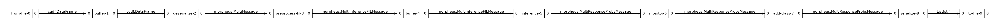

<!--
# Copyright (c) 2021, NVIDIA CORPORATION. All rights reserved.
#
# Redistribution and use in source and binary forms, with or without
# modification, are permitted provided that the following conditions
# are met:
#  * Redistributions of source code must retain the above copyright
#    notice, this list of conditions and the following disclaimer.
#  * Redistributions in binary form must reproduce the above copyright
#    notice, this list of conditions and the following disclaimer in the
#    documentation and/or other materials provided with the distribution.
#  * Neither the name of NVIDIA CORPORATION nor the names of its
#    contributors may be used to endorse or promote products derived
#    from this software without specific prior written permission.
#
# THIS SOFTWARE IS PROVIDED BY THE COPYRIGHT HOLDERS ``AS IS'' AND ANY
# EXPRESS OR IMPLIED WARRANTIES, INCLUDING, BUT NOT LIMITED TO, THE
# IMPLIED WARRANTIES OF MERCHANTABILITY AND FITNESS FOR A PARTICULAR
# PURPOSE ARE DISCLAIMED.  IN NO EVENT SHALL THE COPYRIGHT OWNER OR
# CONTRIBUTORS BE LIABLE FOR ANY DIRECT, INDIRECT, INCIDENTAL, SPECIAL,
# EXEMPLARY, OR CONSEQUENTIAL DAMAGES (INCLUDING, BUT NOT LIMITED TO,
# PROCUREMENT OF SUBSTITUTE GOODS OR SERVICES; LOSS OF USE, DATA, OR
# PROFITS; OR BUSINESS INTERRUPTION) HOWEVER CAUSED AND ON ANY THEORY
# OF LIABILITY, WHETHER IN CONTRACT, STRICT LIABILITY, OR TORT
# (INCLUDING NEGLIGENCE OR OTHERWISE) ARISING IN ANY WAY OUT OF THE USE
# OF THIS SOFTWARE, EVEN IF ADVISED OF THE POSSIBILITY OF SUCH DAMAGE.
-->

# Anomalous Behavior Profiling with Forest Inference Library (FIL) Example

This example illustrates how to use Morpheus to automatically detect abnormal behavior in NVIDIA SMI logs by utilizing a Forest Inference Library (FIL) model and Triton Inference Server. The particular behavior we will be looking for is cryptocurrency mining.

## Background

The goal of this example is to identify whether or not a monitored NVIDIA GPU is actively mining for cryptocurrencies and take corrective action if detected. Cryptocurrency mining can be a large resource drain on GPU clusters and detecting mining can be difficult since mining workloads look similar to other valid workloads.

In this example, we will be using Morpheus' provided ABP NVSMI Detection model. This model is capable of detecting the signature of cryptocurrency mining from the output of `nvidia-smi` logs. For each timestamp that `nvidia-smi` log data is available, the model will output a single probability indicating whether mining was detected or not.

### The Dataset

The dataset that this workflow was designed to process contains NVIDIA GPU metrics at regular time intervals and is extracted by a NetQ agent and serialized into JSON. Each line in the dataset contains much of the same information that is returned by the `nvidia-smi` utility. We won't look at a full message directly since each line contains 176 different columns, but it's possible to get a idea of how the dataset was generated using the `nvidia-smi dmon` command. If you run this yourself, you will se output similar to the following:

```bash
$ nvidia-smi dmon
# gpu   pwr gtemp mtemp    sm   mem   enc   dec  mclk  pclk
# Idx     W     C     C     %     %     %     %   MHz   MHz
    0    70    48     -     5     1     0     0  7000  1350
    0    68    48     -    11     1     0     0  7000  1350
    0    69    48     -     3     1     0     0  7000  1350
    0   270    53     -    10     1     0     0  7000  1875
    0   274    55     -    75    46     0     0  7000  1740
    0   278    55     -    86    56     0     0  7000  1755
    0   279    56     -    99    63     0     0  7000  1755
    0   277    57     -    86    55     0     0  7000  1755
    0   281    57     -    85    54     0     0  7000  1740
```

Each line in the output represents the GPU metrics at a single point in time. As the tool progresses the GPU begins to be utilized and you can see the SM% and Mem% increase as memory is loaded into the GPU and computations are performed. The model we will be using can ingest this information and determine whether or not the GPU is mining cryptocurriences without needing additional information from the host machine.

In this example we will be using the `data/nvsmi.jsonlines` dataset that is known to contain mining behavior profiles. The dataset is in the `.jsonlines` format which means each new line represents an new JSON object. In order to parse this data, it must be ingested, split by lines into individual JSON objects, and parsed into cuDF dataframes. This will all be handled by Morpheus.

## Pipeline Architecture

The pipeline we will be using in this example is a simple feed-forward linear pipeline where the data from each stage flows on to the next. Simple linear pipelines with no custom stages, like this example, can be configured via the Morpheus CLI or using the Python library. In this example we will be using the Morpheus CLI.

Below is a visualization of the pipeline showing all of the stages and data types as it flows from one stage to the next.




## Setup

This example utilizes the Triton Inference Server to perform inference. We will be using a custom Triton backend that must be separately compiled in order to run FIL models.


### Building the FIL Triton Backend

The FIL Triton back end is stored in a separate repository that must be checked out and built using the following:

```bash
# Build FIL Backend for Triton
git clone git@github.com:wphicks/triton_fil_backend.git
cd triton_fil_backend
docker build -t triton_fil -f ops/Dockerfile .
```

This will create a container with the tag `triton_fil:latest`. We will be using this image for the rest of the example

### Launching Triton

From the Morpheus repo root directory, run the following to launch Triton and load the `abp-nvsmi-xgb` XGBoost model:

```bash
docker run --rm -ti --gpus=all -p8000:8000 -p8001:8001 -p8002:8002 -v $PWD/models:/models triton_fil:latest tritonserver --model-repository=/models/triton-model-repo --exit-on-error=false --model-control-mode=explicit --load-model abp-nvsmi-xgb
```

This will launch Triton and only load the `abp-nvsmi-xgb` model. This model has been configured with a max batch size of 32768, and to use dynamic batching for increased performance.

Once Triton has loaded the model, you should see the following in the output:

```
+-------------------+---------+--------+
| Model             | Version | Status |
+-------------------+---------+--------+
| abp-nvsmi-xgb     | 1       | READY  |
+-------------------+---------+--------+
```

If you do not see this in the output, check the Triton log for any error messages related to loading the model.

## Running the Pipeline

With the Morpheus CLI, an entire pipeline can be configured and run without writing any code. Using the `morpheus run pipeline-fil` command, we can build the pipeline by specifying each stage's name and configuration right on the command line. The output of each stage will become the input for the next.

The following command line is the entire command to build and launch the pipeline. Each new line represents a new stage. The comment above each stage gives information about why the stage was added and configured this way (you can copy/paste the entire command with comments).

```bash
export MORPHEUS_ROOT=../..
# Launch Morpheus printing debug messages
morpheus --debug --log_level=DEBUG \
   `# Run a pipeline with 8 threads and a model batch size of 32 (Must be equal or less than Triton config)` \
   run --num_threads=8 --pipeline_batch_size=1024 --model_max_batch_size=1024 \
   `# Specify a NLP pipeline with 256 sequence length (Must match Triton config)` \
   pipeline-fil --viz_file pipeline.png \
   `# 1st Stage: Read from file` \
   from-file --filename=$MORPHEUS_ROOT/data/nvsmi.jsonlines \
   `# 2nd Stage: Buffer upstream stage data (improves performance)` \
   buffer \
   `# 3rd Stage: Deserialize from JSON strings to objects` \
   deserialize \
   `# 4th Stage: Preprocessing converts the input data into BERT tokens` \
   preprocess \
   `# 5th Stage: Another buffer before inference for performance` \
   buffer \
   `# 6th Stage: Send messages to Triton for inference. Specify the model loaded in Setup` \
   inf-triton --model_name=abp-nvsmi-xgb --server_url=localhost:8001 \
   `# 7th Stage: Monitor stage prints throughput information to the console` \
   monitor --description "Inference Rate" --smoothing=0.001 --unit inf \
   `# 8th Stage: Add results from inference to the messages` \
   add-class \
   `# 9th Stage: Convert from objects back into strings. Ignore verbose input data` \
   serialize --exclude '^nvidia_smi_log' --exclude '^ts_' \
   `# 10th Stage: Write out the JSON lines to the detections.jsonlines file` \
   to-file --filename=detections.jsonlines --overwrite
```

If successful, you should see the following output:

```bash
Configuring Pipeline via CLI
Starting pipeline via CLI... Ctrl+C to Quit
Config:
{
  "dask": {
    "use_processes": false
  },
  "debug": true,
  "feature_length": 29,
  "log_config_file": null,
  "log_level": 10,
  "mode": "FIL",
  "model_max_batch_size": 1024,
  "num_threads": 8,
  "pipeline_batch_size": 1024,
  "use_dask": false
}
====Building Pipeline====
Added source: <from-file-0; FileSourceStage(filename=../../data/nvsmi.jsonlines, iterative=None)>
  └─> cudf.DataFrame
Added stage: <buffer-1; BufferStage(count=1000)>
  └─ cudf.DataFrame -> cudf.DataFrame
Adding timestamp info for stage: 'deserialize'
Added stage: <deserialize-2; DeserializeStage()>
  └─ cudf.DataFrame -> morpheus.MultiMessage
Adding timestamp info for stage: 'preprocess-fil'
Added stage: <preprocess-fil-3; PreprocessFILStage()>
  └─ morpheus.MultiMessage -> morpheus.MultiInferenceFILMessage
Added stage: <buffer-4; BufferStage(count=1000)>
  └─ morpheus.MultiInferenceFILMessage -> morpheus.MultiInferenceFILMessage
Adding timestamp info for stage: 'inference'
Added stage: <inference-5; TritonInferenceStage(model_name=abp-nvsmi-xgb, server_url=localhost:8001, force_convert_inputs=False)>
  └─ morpheus.MultiInferenceFILMessage -> morpheus.MultiResponseProbsMessage
Added stage: <monitor-6; MonitorStage(description=Inference Rate, smoothing=0.001, unit=inf, determine_count_fn=None)>
  └─ morpheus.MultiResponseProbsMessage -> morpheus.MultiResponseProbsMessage
Added stage: <add-class-7; AddClassificationsStage(threshold=0.5, labels_file=None, labels=['mining'], prefix=)>
  └─ morpheus.MultiResponseProbsMessage -> morpheus.MultiResponseProbsMessage
Added stage: <serialize-8; SerializeStage(include=[], exclude=['^nvidia_smi_log', '^ts_'], as_cudf_df=False)>
  └─ morpheus.MultiResponseProbsMessage -> List[str]
Added stage: <to-file-9; WriteToFileStage(filename=detections.jsonlines, overwrite=True)>
  └─ List[str] -> List[str]
====Building Pipeline Complete!====
Pipeline visualization saved to pipeline.png
====Starting Pipeline====
====Pipeline Started====
Inference Rate: 1242inf [00:09, 850.45inf/s]
```

**Note:** The pipeline will not shut down when complete. Once the number of inferences has stopped changing, press Ctrl+C to exit.

The output file `detections.jsonlines` will contain a single boolean value for each input line. At some point you should see it switch from `false` to `true`:

```json
...
{"mining": false}
{"mining": false}
{"mining": false}
{"mining": false}
{"mining": true}
{"mining": true}
{"mining": true}
{"mining": true}
{"mining": true}
{"mining": true}
{"mining": true}
{"mining": true}
...
```

 We have stripped out most of the input data to make the detections easier to see. Ommitting the argument `--exclude '^nvidia_smi_log'` would show the input data in the detections file.
