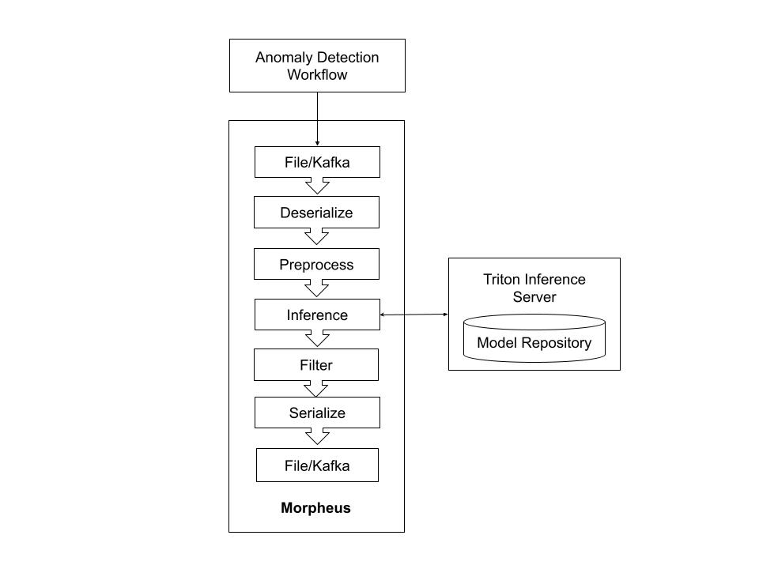

<!--
# Copyright (c) 2021, NVIDIA CORPORATION. All rights reserved.
#
# Redistribution and use in source and binary forms, with or without
# modification, are permitted provided that the following conditions
# are met:
#  * Redistributions of source code must retain the above copyright
#    notice, this list of conditions and the following disclaimer.
#  * Redistributions in binary form must reproduce the above copyright
#    notice, this list of conditions and the following disclaimer in the
#    documentation and/or other materials provided with the distribution.
#  * Neither the name of NVIDIA CORPORATION nor the names of its
#    contributors may be used to endorse or promote products derived
#    from this software without specific prior written permission.
#
# THIS SOFTWARE IS PROVIDED BY THE COPYRIGHT HOLDERS ``AS IS'' AND ANY
# EXPRESS OR IMPLIED WARRANTIES, INCLUDING, BUT NOT LIMITED TO, THE
# IMPLIED WARRANTIES OF MERCHANTABILITY AND FITNESS FOR A PARTICULAR
# PURPOSE ARE DISCLAIMED.  IN NO EVENT SHALL THE COPYRIGHT OWNER OR
# CONTRIBUTORS BE LIABLE FOR ANY DIRECT, INDIRECT, INCIDENTAL, SPECIAL,
# EXEMPLARY, OR CONSEQUENTIAL DAMAGES (INCLUDING, BUT NOT LIMITED TO,
# PROCUREMENT OF SUBSTITUTE GOODS OR SERVICES; LOSS OF USE, DATA, OR
# PROFITS; OR BUSINESS INTERRUPTION) HOWEVER CAUSED AND ON ANY THEORY
# OF LIABILITY, WHETHER IN CONTRACT, STRICT LIABILITY, OR TORT
# (INCLUDING NEGLIGENCE OR OTHERWISE) ARISING IN ANY WAY OUT OF THE USE
# OF THIS SOFTWARE, EVEN IF ADVISED OF THE POSSIBILITY OF SUCH DAMAGE.
-->

# Anomaly Detection Example Using Morpheus

## Background

### Workflow Architecture

For each input log, this workflow uses multiple Morpheus stages.



## Setup
To run this example, an instance of Triton Inference Server and a sample dataset is required. The following steps will outline how to build and run Trtion with the provided FIL model and how to generate the input dataset.

### FIL Backend Triton Inference Server

##### Download source code
```bash
git clone https://github.com/wphicks/triton_fil_backend
```
Note: The `triton_fil_backend` repo can be cloned in any directory you like. It does not need to be within the Morpheus repo.
##### Build Docker Image

```bash
cd triton_fil_backend
docker build -t triton_fil -f ops/Dockerfile .
```

##### Deploy Triton Inference Server

Bind the provided `anomaly_detection_fil_model` directory to the docker container model repo at `/models`.

```bash
# Change directory to the anomaly detection example folder
cd <MORPHEUS_ROOT>/examples/anomaly_detection

# Launch the container
docker run --rm --gpus=all -p 8000:8000 -p 8001:8001 -p 8002:8002 -v $PWD/examples/anomaly_detection/anomaly_detection_fil_model:/models/anomaly_detection_fil_model --name tritonserver triton_fil tritonserver --model-repository=/models --exit-on-error=false --model-control-mode=poll --repository-poll-secs=30
```

##### Verify Model Deployment
Once Triton server finishes starting up, it will display the status of all loaded models. Successful deployment of the model will show the following:
```bash
+-----------------------------+---------+--------+
| Model                       | Version | Status |
+-----------------------------+---------+--------+
| anomaly_detection_fil_model | 1       | READY  |
+-----------------------------+---------+--------+
```

### Generate Sample Data
To input data into Morpheus, sample data must be generated. The provided script `pcap_data_producer.py` will generate the necessary data for the pipeline. To see how the script should be used, use the `--help` command:
```bash
$ python ./morpheus/examples/anomaly_detection/pcap_data_producer.py --help
Usage: pcap_data_producer.py [OPTIONS]

Options:
  --count INTEGER  The number of logs that must be produced
  --file TEXT      The path to the file where the created logs will be saved.
  --help           Show this message and exit.

```

To generate 1000 samples in the file `pcap.jsonlines`, run the following. 

```bash
cd <MORPHEUS_ROOT>/examples/anomaly_detection
python pcap_data_producer.py --count 1000 --file pcap.jsonlines
```
Note: The generated file will be located at `<MORPHEUS_ROOT>/examples/anomaly_detection/pcap.jsonlines`. This path will be required when launching the pipeline.

## Anomaly Detection Pipeline
Use Morpheus to run the Anomaly Detection Pipeline with the previously created input dataset. A pipeline has been configured in `run.py` with several command line options:

```bash
python run.py --help
Usage: run.py [OPTIONS]

Options:
  --num_threads INTEGER RANGE     Number of internal pipeline threads to use
  --pipeline_batch_size INTEGER RANGE
                                  Internal batch size for the pipeline. Can be
                                  much larger than the model batch size. Also
                                  used for Kafka consumers

  --model_max_batch_size INTEGER RANGE
                                  Max batch size to use for the model
  --input_file PATH               Input filepath  [required]
  --output_file TEXT              The path to the file where the inference
                                  output will be saved.

  --model_fea_length INTEGER RANGE
                                  Features length to use for the model
  --model_name TEXT               The name of the model that is deployed on
                                  Tritonserver

  --server_url TEXT               Tritonserver url  [required]
  --help                          Show this message and exit.
```

To launch the configured Morpheus pipeline with the generated sample data, run the following:

```bash
python run.py \
	--input_file pcap.jsonlines \
	--output_file pcap_out.jsonlines \
	--model_name 'anomaly_detection_fil_model' \
	--server_url localhost:8001
```
Note: Both Morpheus and Trinton Inference Server containers must have access to the same GPUs in order for this example to work.

The pipeline will process the input `pcap.jsonlines` sample data and write it to `pcap_out.jsonlines`. Once complete, Morpheus will need to be manually stopped with Ctrl+C (Pipelines are meant to be continuously run).

### Pipeline Visualization

The script `run.py` will also generate a visualization of the pipeline at `<MORPHEUS_ROOT>/examples/anomaly_detection/pipeline.png`. You should see something similar to this:

