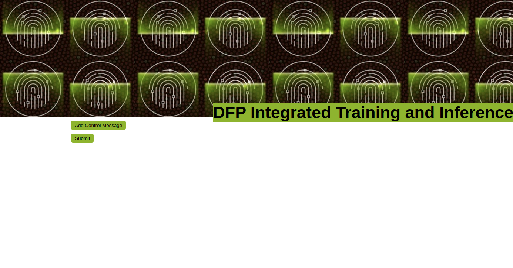
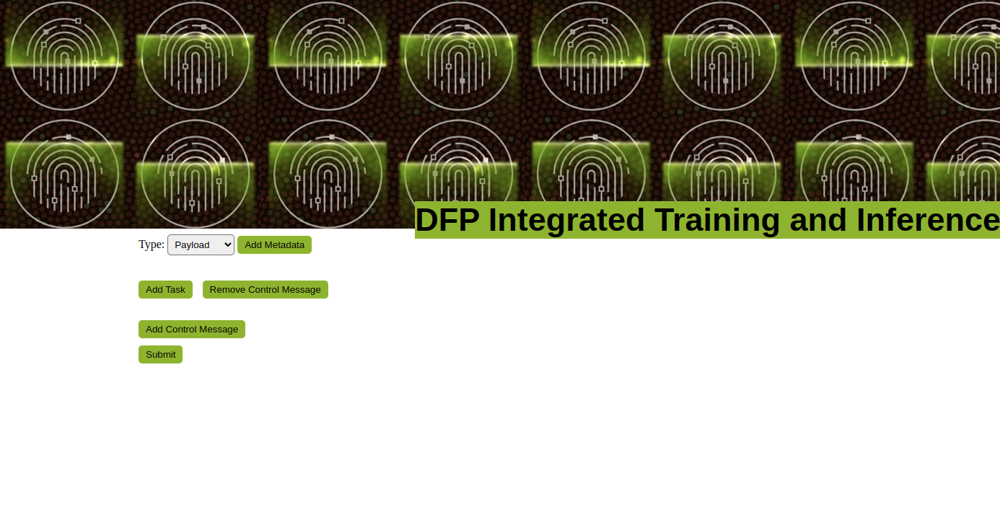
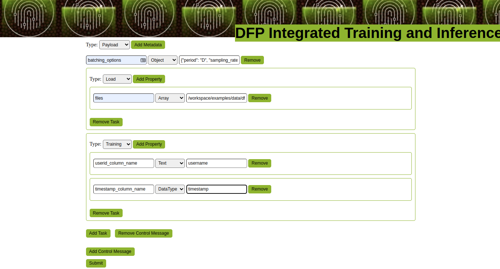
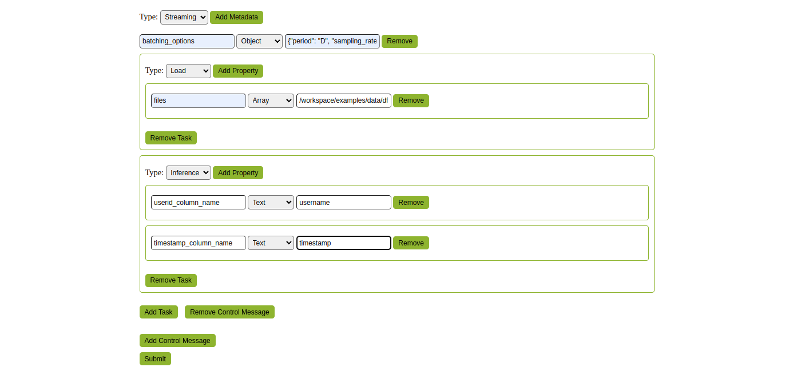
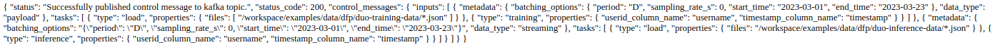

# Control Message GUI

## Introduction
This document provides a comprehensive guide on how to use a Control Messages Submission GUI for digital fingerprinting workflow. With this GUI, users can create and submit control messages to a Kafka topic for load, training, inference of a digital fingerprinting workflow. The GUI provides extensive options for control message creation, such as adding multiple tasks, configuring key-value parameters at task and control message levels, and also provides option for selecting the data type (payload or streaming). In addition, users can easily remove tasks and submit multiple control messages with just a click. By the end of this document, you will have a working Control Messages Submission GUI that will enhance your digital fingerprinting workflow usage experience.

## Home
The UI will look like a dynamic form with various buttons and input fields that allow the user to specify their own metadata, tasks, and properties. The form will then generate a control message. This UI will allow the user to create any number of control messages with metadata and tasks with their own properties.



By clicking on the `Add Control Message` button adds a new control message to the form. Each control message has a type selector and three buttons, one to add "metadata", to add "tasks" and the other to remove control message.


- `Type`: A user may provide a control message of either the "streaming" or "payload" kind. Pipeline handles the message in accordance with the type provided.
- `Add Metadata`: button adds a new metadata section to the control message. Each metadata section has a key selector, a data type selector, a value input field, and a `Remove` button.
- `Add Task`: button adds a new task section to the input. Each task section has a type selector, a `Properties` section, and a `Remove` button.
  - `Add Property`: button inside the `Properties` section adds a new property section to the task. Each property section has a key input field, a data type selector, a value input field, and a `Remove` button.


## Example
Let's just create an example with some digital fingerprinting pipeline properties to generate multiple control messages.

Note: By default DataType is set to "Text". If the DataType is set to "Array," string with commas in it will be changed to an array. Similar to this, a dictionary will be created from a json string whose DataType is set to an object.

### Control Message Training

Here we build a control message for training with below parameters.

  - Metadata Properties:
    - `Type` (Selector): `payload`
    - `batching_options` (Object): `{"period": "D", "sampling_rate_s": 0, "start_time": "2023-03-01", "end_time": "2023-03-23"}`
  - Task Properties:
    - `Type` (Selector): `Load`
    - `files` (Array): ```/workspace/examples/data/dfp/duo-training-data/*.json```
  - Task Properties:
    - `Type` (Selector): `Training`
    - `userid_column_name` (Text): ```username```
    - `timestamp_column_name` (Text): ```timestamp```



### Control Message Inference

Here we build a control message for inference with below parameters.

  - Metadata Properties:
    - `Type` (Selector): `streaming`
    - `batching_options` (Object): `{"period": "D", "sampling_rate_s": 0, "start_time": "2023-03-01", "end_time": "2023-03-23"}`
  - Task Properties:
    - `Type` (Selector): `Load`
    - `files` (Array): ```/workspace/examples/data/dfp/duo-inference-data/*.json```
  - Task Properties:
    - `Type` (Selector): `Inference`
    - `userid_column_name` (Text): ```username```
    - `timestamp_column_name` (Text): ```timestamp```




#### Submit

Response to a user submitted action



Finally, GUI generates a list of control messages, which is displayed below.
```json
{
  "inputs": [
    {
      "metadata": {
        "batching_options": {
          "period": "D",
          "sampling_rate_s": 0,
          "start_time": "2023-03-01",
          "end_time": "2023-03-23"
        },
        "data_type": "payload"
      },
      "tasks": [
        {
          "type": "load",
          "properties": {
            "files": [
              "/workspace/examples/data/dfp/duo-training-data/*.json"
            ]
          }
        },
        {
          "type": "training",
          "properties": {
            "userid_column_name": "username",
            "timestamp_column_name": "timestamp"
          }
        }
      ]
    },
    {
      "metadata": {
        "batching_options": {
          "period": "D",
          "sampling_rate_s": 0,
          "start_time": "2023-03-01",
          "end_time": "2023-03-23"
        },
        "data_type": "streaming"
      },
      "tasks": [
        {
          "type": "load",
          "properties": {
            "files": [
              "/workspace/examples/data/dfp/duo-inference-data/*.json"
            ]
          }
        },
        {
          "type": "inference",
          "properties": {
            "userid_column_name": "username",
            "timestamp_column_name": "timestamp"
          }
        }
      ]
    }
  ]
}
```
