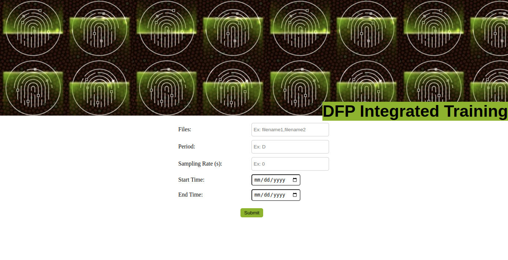
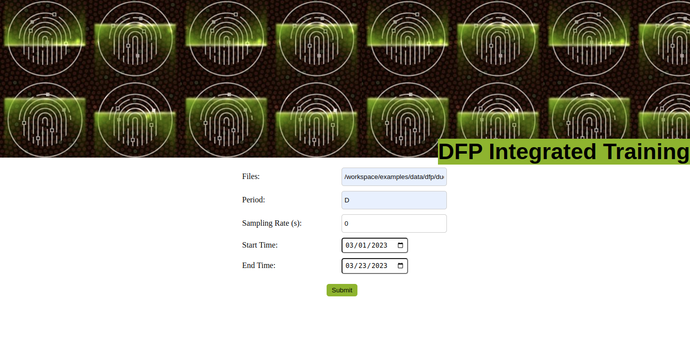
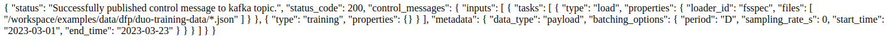

# Training Control Message GUI

## Introduction
This document demonstrates how to use a GUI to submit training control messages to a Kafka topic, which will be consumed by the DFP Morpheus pipeline in the backend. To begin, let's assume that we have a set of training data files located in the file system at `/workspace/examples/data/dfp/duo-training-data`. We can use these files as an input data for the training message.

## Home
To submit a training message, we need to provide some input values. The following screenshot shows the input values we need to enter:



Here's what each input field means:

- `Files` : This field allows you to enter the name of the files you want to use for the training. You can enter multiple filenames separated by commas.

- `Period` : This field allows you to specify the period for which you want to run the training. Enter a single letter representing the period, such as "D" for day or "W" for week.

- `Sampling Rate (s)` : This field allows you to specify the sampling rate for the data you want to use for the training. Enter a number representing the sampling rate in seconds.

- `Start Time` : This field allows you to specify the start time of the provided input data for the training. Select a date from a calendar widget.

- `End Time` : This field allows you to specify the end time of the provided input data for the training. Select a date from a calendar widget.


## Submit
Once the user has submitted inputs as shown in the below screenshot, the GUI generates a training control message and displays a response with the submitted message and the status code of the submission.



Response to a user submitted action




## View Results
In addition to the GUI, submitted control messages can also be viewed from the Kafka topic using the Kafka console consumer. Here is an example command to view the topic:

```bash
docker exec -it kafka kafka-console-consumer --topic test_cm --bootstrap-server localhost:9092
```
Which will display the training control message in JSON format. The message will contain information about the files used for training, the training period, and other metadata about the training run.

Output:
```json
{
  "inputs": [
    {
      "tasks": [
        {
          "type": "load",
          "properties": {
            "loader_id": "fsspec",
            "files": [
              "/workspace/examples/data/dfp/duo-training-data/*.json"
            ]
          }
        },
        {
          "type": "training",
          "properties": {}
        }
      ],
      "metadata": {
        "data_type": "payload",
        "batching_options": {
          "period": "D",
          "sampling_rate_s": 0,
          "start_time": "2023-03-01",
          "end_time": "2023-03-23"
        }
      }
    }
  ]
}
```
