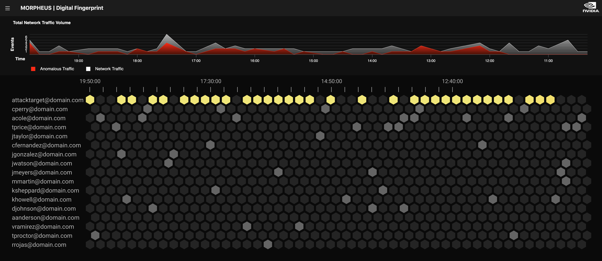

<!--
# Copyright (c) 2021-2022, NVIDIA CORPORATION.
#
# Licensed under the Apache License, Version 2.0 (the "License");
# you may not use this file except in compliance with the License.
# You may obtain a copy of the License at
#
#     http://www.apache.org/licenses/LICENSE-2.0
#
# Unless required by applicable law or agreed to in writing, software
# distributed under the License is distributed on an "AS IS" BASIS,
# WITHOUT WARRANTIES OR CONDITIONS OF ANY KIND, either express or implied.
# See the License for the specific language governing permissions and
# limitations under the License.
-->

# Digital Fingerprinting (DFP) Visualization Example

We show here how to set up and run the Production DFP pipeline on Azure and Duo log data to generate input files for the DFP visualization UI. You can find more information about the Production DFP pipeline in this [README](../production/README.md) and the [DFP Developer Guide](../../../docs/source/developer_guide/guides/5_digital_fingerprinting.md).

## Prerequisites

To run the demo you will need the following:
- Docker
- `docker-compose` (Tested with version 1.29)

## Pull `morpheus-visualizations` submodule

```bash
git submodule update --init --recursive
```

## Build the Morpheus container
This is necessary to get the latest changes needed for DFP. From the root of the Morpheus repo:
```bash
./docker/build_container_release.sh
```

## Building Services via `docker-compose`

```bash
cd examples/digital_fingerprinting/production
export MORPHEUS_CONTAINER_VERSION="$(git describe --tags --abbrev=0)-runtime"
docker-compose build
```

## Start Morpheus Pipeline Container

From the `examples/digital_fingerprinting/production` directory run:
```bash
docker-compose run -p 3000:3000 morpheus_pipeline bash
```

The `-p 3000:3000` maps the visualization app to port 3000 on the host for access via web browser. Starting the `morpheus_pipeline` service will also start the `mlflow` service in the background. For debugging purposes it can be helpful to view the logs of the running MLflow service.

By default, a mlflow dashboard will be available at:
```bash
http://localhost:5000
```


## Download DFP Example Data from S3

Run the following in your `morpheus_pipeline` container to download example data from S3:

```
/workspace/examples/digital_fingerprinting/fetch_example_data.py all
```

Azure training data will be saved to `/workspace/examples/data/dfp/azure-training-data`, inference data to `/workspace/examples/data/dfp/azure-inference-data`.
Duo training data will be saved to `/workspace/examples/data/dfp/duo-training-data`, inference data to `/workspace/examples/data/dfp/duo-inference-data`.

## Running pipeline to generate input for DFP Visualization

The pipeline uses `DFPVizPostprocStage` to perform post-processing on DFP inference output. The inference output is converted to input format expected by the DFP Visualization and saves to multiple files based on specified time period. Time period to group data by must be [one of pandas' offset strings](https://pandas.pydata.org/docs/user_guide/timeseries.html#timeseries-offset-aliases). The default period is one day (D). The output files will be named by appending period to prefix (e.g. `dfp-viz-2022-08-30.csv`). These are the available options used for `DFPVizPostprocStage`:

```
--period                   Time period to batch input data and save output files by. [default: `D`]
--output_dir               Directory to which the output files will be written. [default: current directory]
--output_prefix            Prefix for output files.
```

Set `PYTHONPATH` environment variable to allow import of production DFP Morpheus stages:
```
export PYTHONPATH=/workspace/examples/digital_fingerprinting/production/morpheus
```

### Azure

```
cd /workspace/examples/digital_fingerprinting/visualization
```

Train DFP user models using Azure log files in `/workspace/examples/data/dfp/azure-training-data` and save them to MLflow.
```
python dfp_viz_azure_pipeline.py \
    --train_users=all \
    --log_level=debug \
    --start_time=2022-08-01 \
    --input_file=/workspace/examples/data/dfp/azure-training-data/AZUREAD_2022-08-*.json
```
**Note:** Since models are persisted to a Docker volume, the above command only needs to be run once even if the `mlflow` service is restarted.

Run inference with DFP viz postprocessing using Azure log files in `/workspace/examples/data/dfp/azure-inference-data` to generate input files for Azure DFP visualization:
```
python dfp_viz_azure_pipeline.py \
    --train_users=none \
    --log_level=debug \
    --start_time=2022-08-30 \
    --input_file=/workspace/examples/data/dfp/azure-inference-data/AZUREAD_2022-08-*.json \
    --output_dir=./azure-dfp-output
```

When the pipeline run completes, the `dfp-viz-azure-2022-08-30.csv` and `dfp-viz-azure-2022-08-31.csv` output files will be present in the `azure-dfp-output` directory. These files can be used as input to the DFP Viz UI.

### Duo

Train:
```
python dfp_viz_duo_pipeline.py \
    --train_users=all \
    --log_level=debug \
    --start_time=2022-08-01 \
    --input_file=/workspace/examples/data/dfp/duo-training-data/DUO_2022-08-*.json
```
Inference:
```
python dfp_viz_duo_pipeline.py \
    --train_users=none \
    --log_level=debug \
    --start_time=2022-08-30 \
    --input_file=/workspace/examples/data/dfp/duo-inference-data/DUO_2022-08-*.json \
    --output_dir=./duo-dfp-output
```

## Install DFP Visualization Tool

While still in the `morpheus_pipeline` container, perform the following steps to install and run the DFP Visualization Tool:

### Install dependencies
```
cd viz
```
```
corepack enable
```
```
yarn
```

### Configure `dataset_path`
Set the `dataset_path` environment variable to directory where viz input files will be read from. For this example, we'll set it to directory that contains our Azure DFP output files:
```
export dataset_path=/workspace/examples/digital_fingerprinting/visualization/azure-dfp-output
```

### Start server
```
yarn dev
```

The DFP Visualization Tool can now be accessed via web browser at http://localhost:3000.



More information about the DFP Visualization Tool can be found [here](https://github.com/nv-morpheus/morpheus-visualizations/tree/HEAD/DFP).
