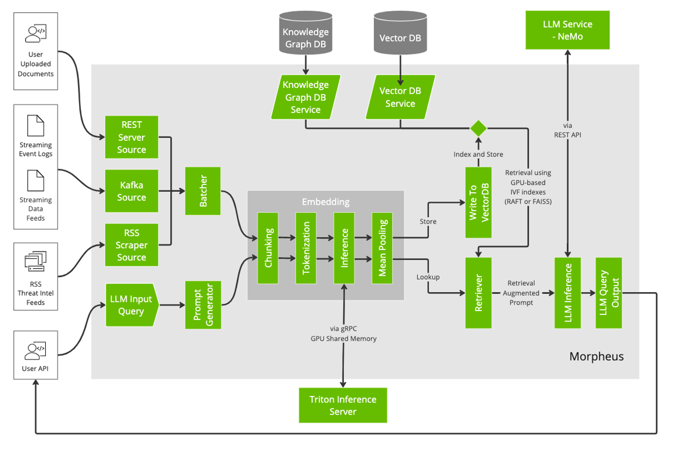

<!--
SPDX-FileCopyrightText: Copyright (c) 2023, NVIDIA CORPORATION & AFFILIATES. All rights reserved.
SPDX-License-Identifier: Apache-2.0

Licensed under the Apache License, Version 2.0 (the "License");
you may not use this file except in compliance with the License.
You may obtain a copy of the License at

http://www.apache.org/licenses/LICENSE-2.0

Unless required by applicable law or agreed to in writing, software
distributed under the License is distributed on an "AS IS" BASIS,
WITHOUT WARRANTIES OR CONDITIONS OF ANY KIND, either express or implied.
See the License for the specific language governing permissions and
limitations under the License.
-->

# Retrieval Augmented Generation (RAG) Pipeline

## Table of Contents

## Background Information

### Purpose

The purpose of this example is to illustrate how a user could build a Retrieval Augmented Generation pipeline
integrating informational feeds and an LLM service into a Morpheus pipeline. This example builds on the previous
example [completionpipeline](../completion/README.md), by adding the ability to augment LLM queries with context
information from a knowledge base. Appending this context helps improve the responses from the LLM by providing
additional background contextual and factual information which the LLM can pull from for its response.

### Source Documents

- In order for this pipeline to function correctly, a Vector Database must already have been populated with information
  that can be retrieved.
- An example of populating a database is illustrated in [VDB upload](../vdb_upload/README.md)
- This example assumes that pipeline has already been run to completion.

### Embedding Model

- This pipeline can support any type of embedding model that can convert text into a vector of floats.
- For the example, we will use `all-MiniLM-L6-v2`. It is small, accurate, and included in the Morpheus repo via LFS;
  it is also the default model used in the [VDB upload](../vdb_upload/README.md) pipeline.

### Vector Database Service

- Any vector database can be used to store the resulting embedding and corresponding metadata.
- It would be trivial to update the example to use Chroma or FAISS if needed.
- For this example, we will be using Milvus since it is the default VDB used in
  the [VDB upload](../vdb_upload/README.md) pipeline.

### Implementation and Design Decisions

### Implementation Details

[Original GitHub issue](https://github.com/nv-morpheus/Morpheus/issues/1306)

In order to cater to the unique requirements of the Retrieval Augmented Generation (RAG) mechanism, the following steps
were incorporated:

- **Embedding Retrieval:** Before the LLM can make a completion, relevant context is retrieved from the Vector Database.
  This context is in the form of embeddings that represent pieces of information closely related to the query.
- **Context Augmentation:** The retrieved context is then appended to the user's query, enriching it with the necessary
  background to assist the LLM in generating a more informed completion.
- **LLM Query Execution:** The augmented query is then sent to the LLM, which generates a response based on the
  combination of the original query and the appended context.

### Rationale Behind Design Decisions

- **Choice of Embedding Model:** all-MiniLM-L6-v2 was chosen due to its compactness and accuracy. This makes it ideal
  for real-time operations and ensures that the embeddings are of high quality.
- **Using Milvus as VDB:** Milvus offers scalable and efficient vector search capabilities, making it a natural choice
  for embedding retrieval in real-time.
- **Flexible LLM integration:** The LLM is integrated into the pipeline as a standalone component, which allows for
  easy swapping of models and ensures that the pipeline can be easily extended to support multiple LLMs.

### Standalone Morpheus Pipeline

The standalone Morpheus pipeline is built using the following components:

- An InMemorySourceStage to hold the LLM queries in a DataFrame.
    - We supply a fixed set of questions in a `source_df` which are then processed by the LLMEngineStage
- A DeserializationStage to convert the MessageMeta objects into ControlMessages needed by the LLMEngine.
    - New functionality was added to the DeserializeStage to support ControlMessages and add a default task to each
      message.
- A LLMEngineStage then wraps the core LLMEngine functionality.
    - An ExtracterNode pulls the questions out of the DataFrame.
    - A RAGNode performs the retrieval and adds the context to the query using the supplied template and executes the
      LLM.
    - Finally, the responses are put back into the ControlMessage using a SimpleTaskHandler.
- The pipeline concludes with an InMemorySink stage to store the results.

> **Note:** For this to function correctly, the VDB upload pipeline must have been run previously.

### Persistent Morpheus Pipeline

#### Technical Overview



The provided diagram illustrates the structural composition of the Morpheus data processing pipeline. This pipeline is
designed with the intent to handle various data streams in support of Retrieval Augmented Generation.

> **Note**: The current `persistent` pipeline implementation differs from the above diagram in the follwing ways:

- The source for the upload and retrieval are both KafkaSourceStage to make it easy for the user to control when
  messages are processed by the example pipeline.
- There is a SplitStage added after the embedding portion of the pipeline which determines which sink to send each
  message to.
- The final sink for the retrieval task is sent to another Kafka topic retrieve_output.

#### Data Input Points

The pipeline has multiple data input avenues:

1. **User Uploaded Documents**: Raw documents provided by users for further processing.
2. **Streaming Event Logs**: Logs that are streamed in real-time.
3. **Streaming Data Feeds**: Continuous streams of data that could be dynamic in nature.
4. **RSS Threat Intel Feeds**: RSS-based feeds that might focus on threat intelligence.
5. **LLM Input Query**: Queries that are inputted for processing by the Large Language Model.

#### Data Processing Stages

The ingested data traverses several processing stages:

1. **Sources Integration**: Data from different origins such as REST Server, Kafka, and RSS Scraper are directed into
   the pipeline.
2. **Batching**: Data items are grouped together for more efficient bulk processing.
3. **Data Transformation**:
    - **Chunking**: Data might be broken into smaller chunks if too large.
    - **Tokenization**: Textual data is typically converted into tokens suitable for model processing.
    - **Embedding**: This step likely converts data into its vector representation.
    - **Mean Pooling**: Embeddings might be combined to yield a mean vector.

4. **Inference**: Models may be used to extract patterns or make predictions from the data.
5. **Storage and Retrieval**: Vector representations are stored in the Vector DB and can be fetched upon request.
   Retrieval might employ GPU-based IVF indexes (such as RAFT or FAISS).

### Backend Components

The pipeline is supported by a set of backend components:

1. **Knowledge Graph DB & Service**: This serves as a potential repository and query mechanism for stored knowledge.
2. **Vector DB & Service**: Appears to handle the storage and querying of vector data.
3. **Triton Inference Server**: An inference component that interfaces with the LLM Service.

## Getting Started

## Prerequisites

Before running the pipeline, we need obtain service API keys for the following services:

### Ensure that LFS files are downloaded

To retrieve models from LFS run the following:

```bash
./scripts/fetch_data.py fetch models
```

### Obtain an OpenAI API or NGC API Key

#### NGC

- Follow the instructions [here](TODO)
- We'll refer to your NGC API key as `${NGC_API_KEY}` for the rest of this document.

#### OpenAI

- Follow the instructions [here](https://platform.openai.com/docs/quickstart?context=python) to obtain an OpenAI
  API key.
- We'll refer to your OpenAI API key as `${OPENAI_API_KEY}` for the rest of this document.

Before running the pipeline, we need to ensure that the following services are running:

### Milvus Service

- Follow the instructions [here](https://milvus.io/docs/install_standalone-docker.md) to install and run a Milvus
  service.

### Triton Service

- Pull the Docker image for Triton:
  ```bash
  docker pull nvcr.io/nvidia/tritonserver:23.06-py3
  ```

- From the Morpheus repo root directory, run the following to launch Triton and load the `all-MiniLM-L6-v2` model:
  ```bash
  docker run --rm -ti --gpus=all -p8000:8000 -p8001:8001 -p8002:8002 -v $PWD/models:/models nvcr.io/nvidia/tritonserver:23.06-py3 tritonserver --model-repository=/models/triton-model-repo --exit-on-error=false --model-control-mode=explicit --load-model all-MiniLM-L6-v2
  ```

  This will launch Triton and only load the `all-MiniLM-L6-v2` model. Once Triton has loaded the model, the following
  will be displayed:
    ```
    +------------------+---------+--------+
    | Model            | Version | Status |
    +------------------+---------+--------+
    | all-MiniLM-L6-v2 | 1       | READY  |
    +------------------+---------+--------+
    ```

### Running the Morpheus Pipeline

The top level entrypoint to each of the LLM example pipelines is `examples/llm/main.py`. This script accepts a set
of Options and a Pipeline to run. Baseline options are below, and for the purposes of this document we'll assume a
pipeline option of `rag`:

### Run example (Standalone Pipeline):

**TODO:** Add model specification syntax

**Using NGC Nemo LLMs**

```bash
export NGC_API_KEY=[YOUR_KEY_HERE]
python examples/llm/main.py rag persistent --model_name gpt-43b-002 --model_type NemoLLM
```

**Using OpenAI LLM models**

```bash
export OPENAI_API_KEY=[YOUR_KEY_HERE]
python examples/llm/main.py rag persistent --model_name gpt-3.5-turbo --model_type OpenAI
```

### Run example (Persistent Pipeline):

**TODO**

**Using NGC Nemo LLMs**

```bash
export NGC_API_KEY=[YOUR_KEY_HERE]
python examples/llm/main.py rag persistent --model_name gpt-43b-002 --model_type NemoLLM
```

**Using OpenAI LLM models**

```bash
export OPENAI_API_KEY=[YOUR_KEY_HERE]
python examples/llm/main.py rag persistent --model_name gpt-3.5-turbo --model_type OpenAI
```

### Options:

- `--log_level [CRITICAL|FATAL|ERROR|WARN|WARNING|INFO|DEBUG]`
    - **Description**: Specifies the logging level.
    - **Default**: `INFO`

- `--use_cpp BOOLEAN`
    - **Description**: Opt to use C++ node and message types over python. Recommended only in case of bugs.
    - **Default**: `False`

- `--version`
    - **Description**: Display the script's current version.

- `--help`
    - **Description**: Show the help message with options and commands details.

### Commands:

- ... other pipelines ...
- `rag`

---

## Options for `rag` Command

The `rag` command has its own set of options and commands:

### Commands:

- `persistant`
- `pipeline`

