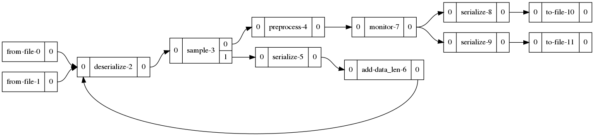

<!--
# Copyright (c) 2021, NVIDIA CORPORATION. All rights reserved.
#
# Redistribution and use in source and binary forms, with or without
# modification, are permitted provided that the following conditions
# are met:
#  * Redistributions of source code must retain the above copyright
#    notice, this list of conditions and the following disclaimer.
#  * Redistributions in binary form must reproduce the above copyright
#    notice, this list of conditions and the following disclaimer in the
#    documentation and/or other materials provided with the distribution.
#  * Neither the name of NVIDIA CORPORATION nor the names of its
#    contributors may be used to endorse or promote products derived
#    from this software without specific prior written permission.
#
# THIS SOFTWARE IS PROVIDED BY THE COPYRIGHT HOLDERS ``AS IS'' AND ANY
# EXPRESS OR IMPLIED WARRANTIES, INCLUDING, BUT NOT LIMITED TO, THE
# IMPLIED WARRANTIES OF MERCHANTABILITY AND FITNESS FOR A PARTICULAR
# PURPOSE ARE DISCLAIMED.  IN NO EVENT SHALL THE COPYRIGHT OWNER OR
# CONTRIBUTORS BE LIABLE FOR ANY DIRECT, INDIRECT, INCIDENTAL, SPECIAL,
# EXEMPLARY, OR CONSEQUENTIAL DAMAGES (INCLUDING, BUT NOT LIMITED TO,
# PROCUREMENT OF SUBSTITUTE GOODS OR SERVICES; LOSS OF USE, DATA, OR
# PROFITS; OR BUSINESS INTERRUPTION) HOWEVER CAUSED AND ON ANY THEORY
# OF LIABILITY, WHETHER IN CONTRACT, STRICT LIABILITY, OR TORT
# (INCLUDING NEGLIGENCE OR OTHERWISE) ARISING IN ANY WAY OUT OF THE USE
# OF THIS SOFTWARE, EVEN IF ADVISED OF THE POSSIBILITY OF SUCH DAMAGE.
-->

# Multi-Input Multi-Output Morpheus Pipeline Example

## Pipeline Architecture

This example shows how to create a Morpheus pipeline with multiple inputs/outputs and even circular dataflow between stages. The pipeline visualization is:



We can see that the `sample-3` stage forks its input into two paths. This is a custom stage that forks message based off whether they have the `data_len` field or not. If the field is missing, the message is routed to `add-data_len-6` which will calculate the `data_len` from the `data` field, reserialize the message, and feed it back into the `deserialize-2` stage.

This has the effect of ensuring the `data_len` field is available. To create messages where some have `data_len` missing, two datasets have been created: `with_data_len.json` and `without_data_len.json`. These datasets both contain 1000 lines and are very similar except for the missing field. Both datasets are loaded and piped into the `deserialze-2` stage where they will be interleaved.

Finally, we illustrate how to use multiple outputs by forking the `monitor-7` stage into two serialization stages. One serialization stage will exclude timestamp information (any field starting with `ts_*`) and the other will not exclude any fields. This results in two output files that only differ by the fields that were serialized.

## Setup

This example does not require Triton Inference Server. No additional setup is required.


## MIMO Pipeline
Use Morpheus to run the MIMO Pipeline with the following command:

```
python ./examples/multi_in_multi_out/run.py
```

This example does not have any configuration options.