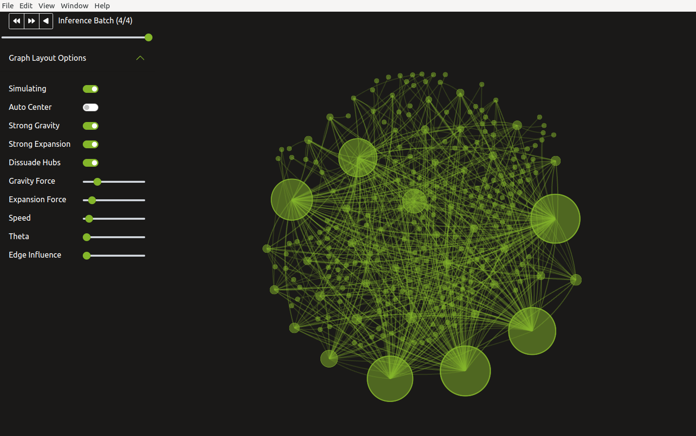

# SID Visualization Example

## Prerequisites

To run the demo you will need the following:
- Docker
- `docker-compose` (Tested with version 1.29)

## Setup

To run this demo, ensure all submodules are checked out:
```bash
git submodule update --init --recursive
```

### Build Morpheus Dev Container

Before launching the demo, we need the dev container for Morpheus to be created:
```bash
export DOCKER_IMAGE_TAG="sid-viz"
```

# Build the dev container
```bash
./docker/build_container_dev.sh
```

### Launch User Interface

We will use docker-compose to build and run the entire demo. To launch everything, run the following from the repo root:

Save the Morpheus repo directory:
```bash
export MORPHEUS_HOME=$(git rev-parse --show-toplevel)
```

Ensure SID model is downloaded for deployment to Triton:
```bash
./scripts/fetch_data.py fetch models
```

Change to the example directory:
```bash
cd ${MORPHEUS_HOME}/examples/sid_visualization
```

Launch the containers:
```bash
DOCKER_BUILDKIT=1 docker-compose up --build -d
```

The following GUI should be displayed when all containers have completed launching:


### Build Morpheus

Once docker-compose command has completed and GUI is displayed, exec into the container to build and run Morpheus:

Exec into the morpheus container:
```bash
docker-compose exec morpheus bash
```

Inside the container, compile morpheus:
```bash
BUILD_DIR=build-docker ./scripts/compile.sh
```

Install morpheus with an extra dependency:
```bash
pip install -e . && pip install websockets
```

Verify Morpheus is installed:
```bash
morpheus --version
```

Ensure the data has been downloaded:
```bash
./scripts/fetch_data.py fetch examples
```

***Keep this shell in the Morpheus Dev container running. It will be used later to start Morpheus.***

## Running the Demo

### Running Morpheus

After the GUI has been launched, Morpheus now needs to be started. In the same shell used to build Morpheus (the one running the Morpheus Dev container), run the following:
```bash
python examples/sid_visualization/run.py \
  --debug --use_cpp=False --num_threads=1 \
  --triton_server_url=triton:8001 \
  --input_file=./examples/data/sid_visualization/group1-benign-2nodes.jsonlines \
  --input_file=./examples/data/sid_visualization/group2-benign-50nodes.jsonlines \
  --input_file=./examples/data/sid_visualization/group3-si-50nodes.jsonlines \
  --input_file=./examples/data/sid_visualization/group4-benign-49nodes.jsonlines
```

**Note:** The first run of this script will take a few minutes to allow Triton to convert the deployed ONNX model to TensorRT. Subsequent runs will not include this conversion step so will be much quicker.

This launch will use all of the available datasets. Each dataset will show up as one batch in the visualization. Here is a description of each dataset:

- `examples/data/sid_visualization/group1-benign-2nodes.jsonlines`
  - Small scale with 2 nodes, no SID
- `examples/data/sid_visualization/group2-benign-50nodes.jsonlines`
  - Scale up to 50 nodes, no SID
- `examples/data/sid_visualization/group3-si-50nodes.jsonlines`
  - 50 nodes, with SID from a single node
- `examples/data/sid_visualization/group4-benign-49nodes.jsonlines`
  - Isolate bad node leaving 49 nodes, no SID

The following is a screenshot after all four batches have been processed:



Use the slider or the following buttons to step through the inferences batches in the visualization:
|                              |                                                   |
| ---------------------------- | ------------------------------------------------- |
|    | Step to previous inference batch                  |
|   | Step to next inference batch                      |
|  | Step through all inference batches from beginning |
|   | Pause animation                                   |

The visualization on the right shows nodes in the current inference batch represented as
green spheres. White (benign) and red (SI) packets are shown flowing between the node connections.
While the animation is running, you can click the pause button or toggle off `Simulating`. Once paused, 
you will be able to hover over an individual packet to view its contents.

Changing the dataset does not require relaunching the GUI. Simply re-run Morpheus with the new dataset and the GUI will be updated.

It's also possible to launch the demo using the Morpheus CLI using the following:

```bash
DEMO_DATASET="examples/data/sid_visualization/group1-benign-2nodes.jsonlines"
```

```bash
morpheus --log_level=DEBUG \
   run --num_threads=1 --pipeline_batch_size=1024 --model_max_batch_size=32 --edge_buffer_size=4 --use_cpp=False \
      pipeline-nlp --model_seq_length=256 \
         from-file --filename=${DEMO_DATASET} \
         deserialize \
         preprocess --vocab_hash_file=morpheus/data/bert-base-uncased-hash.txt --truncation=True --do_lower_case=True --add_special_tokens=False \
         inf-triton --model_name=sid-minibert-onnx --server_url=triton:8001 --force_convert_inputs=True \
         monitor --description Inference\ Rate --unit=inf \
         add-class \
         gen-viz
```

Note, this launch method is more useful for showing performance than showing capability.
